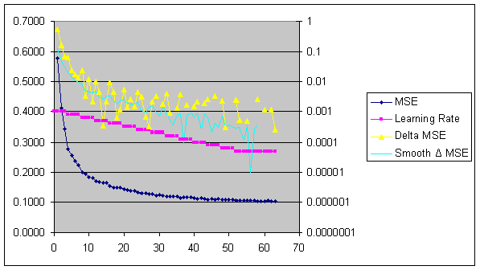

:kr: 손으로 쓴 숫자를 인식하기 위한 신경망  

출처:  
- https://www.codeproject.com/Articles/16650/Neural-Network-for-Recognition-of-Handwritten-Digi

환경:  
- 윈도우(7, 10)  
- 비스 2015, 2010(비주얼스튜디오 2015, 2010)  
- 한글


# 손으로 쓴 숫자를 인식하기 위한 신경망
```
원제: Neural Network for Recognition of Handwritten Digits
```

- [신경망 과제 실연 내려받기 -203KB](https://www.codeproject.com/KB/library/NeuralNetRecognition/Demo-Mnist.zip) (컴파일할 필요없이 실행할수 있는 배포-빌드 실행파일이 포함됨)
- [뉴런 가중값파일 내려받기 - 2,785KB](https://www.codeproject.com/KB/library/NeuralNetRecognition/simpleneutronweightfile.zip) (위에 언급한것을 99.26% 정밀도 달성)
- [MNIST 기초자료 내려받기 - 11,594KB, 모두 4개의 파일임](http://yann.lecun.com/exdb/mnist/index.html) (이 과제를 위해 필요한 4개의 파일에 대한 외부 연결이다)


---

### 알맹이

[**1) 서론**](#서론)  

[1-1) 몇가지 신경망 이론](#몇가지-신경망-이론)  
[1-2) 순전파](#순전파)  
[1-3) 활성함수(시그모이드 또는 찌그림 함수)](#활성함수)  
[1-4) 역전파](#역전파)  
[1-5) 두번째 방법](#두번째-방법)  

[**2) 나선신경망의 구조**](#나선신경망의-구조)  

[2-1) 그림과 일반개념 설명](#그림과-일반개념)  
[2-2) 신경망을 만들기 위한 코드](#신경망을-만들기)  

[**3) 손으로 쓴 숫자의 MNIST 기초자료**](#MNIST-기초자료)

[**4) 평가/실연 프로그램의 전체구조**](#프로그램의-전체구조)  

[4-1) 실연 프로그램 사용](#프로그램-사용)  
[4-2) 신경망의 시각적 보기](#시각적-보기)  
[4-3) 신경망을 벼림 하면서 보기와 제어](#신경망을-벼림)  
[4-4) 신경망의 평가 보기](#신경망의-평가)  

[**5) 신경망 벼림**](#신경망-벼림)  

[**6) 벼림을 빠르게 하기위한 기교**](#벼림을-빠르게)  

[6-1) 모사-헤시안을 사용하여 2차 역전파](#모사-헤시안)  
[6-2) 역전파와 순방향 전파를 동시에 한다](#역전파와-순방향)  
[6-3) 작은 오차에 대해 역전파 빼먹기](#작은-오차)  
 
[**7) 체험한 신경망 벼림**](#체험한-신경망)  

[**8) 결과**](#결과)  

[**9) 참고문헌**](#참고문헌)  

[**10) 권한과 판 정보**](#권한)  

---


<a name="서론"></a>  
## 1) 서론

이 글은 손으로 쓴 숫자를 인식하기 위해 궁리한 인공신경망의 개발을 기록한 것이다. 비록 신경망의 몇가지 이론이 여기에 제시되었지만, 신경망 개념을 이미 이해하고 있다면 더 좋을 것이다, 뉴런, 단, 가중갑, 그리고 역전파 같은.

여기에 묘사된 신경망은 일반목적 신경망이 아니다, 그리고 이것은 일종의 신경망 작업대가 아니다. 오히려, 아주 특별한 하나의 목적(손으로 쓴 숫자를 인식하기 위한)을 위해 만든 하나의 아주 특별한 신경망(5단 나선 신경망)에 촛점을 맞출 것이다.

손으로 쓴 숫자를 인식하기 위해 신경망을 사용하는 발상은 새로운 것이 아니다. 여기에 묘사된 구조에 대한 영감은 두 저자가 쓴 글에서 비롯되었다. 첫번째는 얀 레쿤 박사다(Dr. Yann LeCun), 그는 역전파 알고리즘 기준을 독립적으로 발견했다. 레쿤박사는 그의 [신경망 연구에 대한 훌륭한 사이트](http://yann.lecun.com/)를 운영한다. 특히, 우리는 그의 ["벼림과 시각 인지(Learning and Visual Perception)"](http://yann.lecun.com/exdb/lenet/index.html) 부분을 봐야한다, 이것은 그의 연구결과를 보여주기 위해 생기있는 *GIF*를 사용한다. *MNIST* 기초자료(제공된 손으로 쓴 숫자 기초자료)는 그에 의해서 개발되었다. 나는 그의 출판물 2개를 내 작업 대부분을 위한 자료의 주요 근원으로 사용하였다, 그리고 나는 그의 다른 출판물 또한 읽기를 강력히 추천한다(그의 사이트에 알린). 신경망에 관한 많은 다른 출판물과 달리, 레쿤 박사의 출판물은 이론중점과 수학강조를 하지 않는다; 오히려, 매우 읽기 쉽다, 그리고 실용적인 통찰력과 풀이를 제공한다. 그의 글과 출판물은 [여기](http://yann.lecun.com/exdb/publis/index.html)에서 찾을수 있다. 여기에 내가 의지한 두개의 출판물이 있다:

- Y. LeCun, L. Bottou, Y. Bengio, and P. Haffner, ["문서 인식에 적용된 기울기-기반 학습(Gradient-Based Learning Applied to Document Recognition)"](http://yann.lecun.com/exdb/publis/pdf/lecun-98.pdf), Proceedings of the IEEE, vol. 86, no. 11, pp. 2278-2324, Nov. 1998. [46 페이지]  
- Y. LeCun, L. Bottou, G. Orr, and K. Muller, 신경망에서: 기술적 기교인 ["효율적인 역전파(Efficient BackProp)"](http://yann.lecun.com/exdb/publis/pdf/lecun-98b.pdf), (G. Orr and Muller K., eds.), 1998. [44 페이지]  

두번째 저자는 패트리스 시마드 박사(Dr. Patrice Simard), 이전에 AT&T 연구소에서 같이 일했을 때 레쿤 박사의 협조자이다. 시마드 박사는 지금은 마이크로소프트의 ["문서 처리와 이해(Document Processing and Understanding)"](http://www.research.microsoft.com/dpu/) 모임의 연구원이다. 그의 글과 출판물은 [여기](http://research.microsoft.com/~patrice/publi.html)에서 찾을수 있다, 그리고 내가 의지한 출판물이다:

- Patrice Y. Simard, Dave Steinkraus, John Platt, ["시각 문서 분석에 적용된 나선 신경망에 대한 모범 사례(Best Practices for Convolutional Neural Networks Applied to Visual Document Analysis)"](http://research.microsoft.com/~patrice/PDF/fugu9.pdf), 문서 분석과 인식에 관한 국제회의(International Conference on Document Analysis and Recognition, ICDAR), IEEE Computer Society, Los Alamitos, pp. 958-962, 2003. 

여기에서 나의 목표중 하나는 레쿤 박사가 달성한 정밀도를 재현하는 것이다, 그는 그의 신경망을 99.18% 정밀도 달성하기 위해 벼림할수 있었다(즉, 오류율은 단지 0.82%다). 이 오류율은 일종의 "비교기준(벤치마크)" 제공이다, 내 작업을 안내하는.

마지막 알림으로, 나의 소스코드는 자랑할만한 것은 아니다, 이것은 공학 작업절차를 가장 명확하게 하는 것이다. 나는 좋은 의도로 시작했다, 유연하고 이해하기 쉽고 변경하기 쉽게 소스코드를 만들기 위해. 일이 진행됨에 따라, 코드는 추잡하게 변하기 시작했다. 나는 일을 끝내기 위해 코드를 막 작성했다, 때때로 깔끔한 코드와 이해력을 희생하면서. 버무리기 위해, 또한 다른 구상으로 실험하고, 그중 일부는 작동했고, 일부는 작동하지 않았다. 내가 실패한 구상을 제거했지만, 나는 변경된 모든것을 되돌리지 않았다 따라서 때때로 삐져나온 꼬다리와 끊어진 끝이 있다. 나는 코드를 공개하지 않을 가능성을 고민했다. 하지만 그것은 내가 읽은 글을 비난하는 나였던 것이다: 코드를 포함하지 않은 자들. 그래서, 두려웠고 코드는 비평하기 쉽다고 인식했다 그리고 다시쓰기를 할 수 있었다, 여기에 있다


<a name="몇가지-신경망-이론"></a>  
### 1-1) 몇가지 신경망 이론

이것은 신경망 가르침이 아니다, 하지만 여기에서 사용된 코드와 변수의 이름을 이해하기 위해, 어느정도 신경망 기본을 보는것을 돕는다.

다음 논술은 아주 일반적인 것은 아니다. 이것은 순방향-전달(feed-forward) 신경망만 고려한 것이다, 이것은, 여러 단으로 구성된 신경망이다, 여기에서 뉴런의 각 단은 바로 다음 뉴런의 단만 전달한다, 그리고 사비(입력)는 뉴런의 바로 앞단에서 받는다. 다른 말로, 뉴런은 단을 건너뛰지 않는다.

여러 단으로 구성된 신경망을 고려하라, 각 단에 여러개의 뉴런이 있는. **_n_** 단에서 뉴런 하나에 집중하자, 다시말해 **_i-th_** 뉴런. 이 뉴런은 이전 단에 있는 뉴런의 나옴(출력)에서 사비(입력)를 가져오고, 값이 **`1`** 인 편향값을 더한다. 뉴런 나옴(출력)을 가리키는 변수는 **`x`** 를 사용한다. **_i-th_** 뉴런은 각각의 사비(입력)에 가중값을 적용한다, 그런다음 가중된 사비를 다함께 더한다 그래서 **활성값(activation value)** 이라고 불리는 것을 얻는다. 활성값을 가리키는 변수는 **`y`** 를 사용한다. *i-th* 뉴런은 활성값에 **활성함수** 가 적용된 나옴값 **`x`** 를 계산한다. 활성함수를 가리키는 문자는 **_F()_** 를 사용한다. 활성함수는 때때로 **시그모이드(Sigmoid)** 를 가리킨다, **찌그림(Squashing)** 함수는 다른 이름이다, 때문에 이것의 주 목적은 뉴런 나옴을 -1 ~ +1의 범위 처럼 적당한 범위로 제한하는 것이다, 그리하여 망에 일부의 비선형성 정도를 밀어넣는다. 여기에 신경망의 일부분 그림이 있다; **_n_** 단에서 **_i-th_** 뉴런에 집중하는것을 기억하라:


이것은 각 변수가 의미하는 것이다:  

 는 **_n_** 단에서 **_i_**-th(번째) 뉴런의 나옴이다

 는 **_n_**-1 단에서 **_j_**-th(번째) 뉴런의 나옴이다

 는 **_n_**-1 단에서 **_k_**-th(번째) 뉴런의 나옴이다

 는 가중값이다, **_n_**-1 단(즉 이전 단)에서 **_j_**-th(번째) 뉴런의 나옴에 적용하여 **_n_** 단 안의 **_i_**-th(번째) 뉴런에 적용하는. 다른 말로, 이전단 안의 **_j_**-th(번째) 뉴런 나옴과 현재단(**_n_** 단) 안의 **_i_**-th(번째) 뉴런까지의 가중값이다.

 는 가중값이다, **_n_**-1 단에서 **_k_**-th(번째) 뉴런의 나옴에 적용하여 **_n_** 단 안의 **_i_**-th(번째) 뉴런에 적용하는.

 는 일반적인 순방향-전달 방정식이다, 여기에서 **_F()_**는 활성함수다. 잠시후에 활성화 함수에 대해 더 자세히 설명할 것이다.

이것을 어떻게 코드와 C++ 클래스로 변환하는가? 내가 본 방법은, 위의 도형을 4개의 다른 클래스개체로 구성된 신경망으로 제안한다: 단, 단 안의 뉴런, 한 단의 뉴런에서 다른 단의 뉴런으로 연결, 그리고 연결에 적용되는 가중값. 이러한 4개의 클래스는 코드에 반영되었다, 다섯번째 클래스(신경망 자신)와 함께 이것은 다른 모든 개체를 위한 그릇(container)역할을 한다 그리고 이것은 외부와 주요 접속기를 제공한다. 여기에 클래스 간단히 보기가 있다. 이 코드는 `std::vector`를 많이 사용하는 것을 알린다. 특히 `std::vector< double >`를:

``` java c++
// 간단히 보기: 일부 멤버는 생략되었다,
// 그리고 일부 기호는 대체되었다

// 도움이 되는 typedef
typedef std::vector< NNLayer* >  VectorLayers;
typedef std::vector< NNWeight* >  VectorWeights;
typedef std::vector< NNNeuron* >  VectorNeurons;
typedef std::vector< NNConnection > VectorConnections;

//-----------------------------------------------------
// 신경망 클래스
class NeuralNetwork  
{
public:
    NeuralNetwork();
    virtual ~NeuralNetwork();
    
    void Calculate( double* inputVector
                , UINT      iCount
                , double*   outputVector = NULL
                , UINT      oCount = 0 );

    void Backpropagate( double* actualOutput    // 출력값
                , double*   desiredOutput       // 목표값
                , UINT      count );

    VectorLayers m_Layers;
};

//-----------------------------------------------------
// 단 클래스
class NNLayer
{
public:
    NNLayer( LPCTSTR str, NNLayer* pPrev = NULL );
    virtual ~NNLayer();
    
    void Calculate();
    
    void Backpropagate( std::vector< double >& dErr_wrt_dXn /* in */
                    , std::vector< double >& dErr_wrt_dXnm1 /* out */
                    , double etaLearningRate );

    NNLayer* m_pPrevLayer;
    VectorNeurons m_Neurons;
    VectorWeights m_Weights;
};

//-----------------------------------------------------
// 뉴런 클래스
class NNNeuron
{
public:
    NNNeuron( LPCTSTR str );
    virtual ~NNNeuron();

    void AddConnection( UINT iNeuron, UINT iWeight );
    void AddConnection( NNConnection const & conn );

    double output;

    VectorConnections m_Connections;
};

//-----------------------------------------------------
// 연결 클래스
class NNConnection
{
public: 
    NNConnection(UINT neuron = ULONG_MAX, UINT weight = ULONG_MAX);
    virtual ~NNConnection();

    UINT NeuronIndex;
    UINT WeightIndex;
};

//-----------------------------------------------------
// 가중값 클래스
class NNWeight
{
public:
    NNWeight( LPCTSTR str, double val = 0.0 );
    virtual ~NNWeight();

    double value;
};
```

위에서 보듯이, `NeuralNetwork` 클래스는 신경망안에 벡터로 된 단 주소를 저장한다, 이것은 `NNLayer`로 표현된다. 단을 추가하기 위한 특별한 함수는 없다(혹시 필요할까?); 간단하게 `std::vector::push_back()` 함수를 사용한다. `NeuralNetwork` 클래스는 또한 외부 접속기 2개를 제공한다, 즉, 신경망 순방향 전파를 위한 함수(`Calculate()`) 그리고 신경망을 역전파(`Backpropagate()`)하기 위한 함수 그래서 벼림 하는것.

각각의 `NNLayer`는 이전단에 대한 주소를 저장한다, 그래서 사비(입력)값을 어디에서 찾을지 알수 있다. 게다가 단 안에 벡터로 된 뉴런 주소를 저장한다, `NNNeuron` 클래스로 표현된다. 그리고 벡터로 된 가중값 주소, `NNWeight` 클래스로 표현된다. `NeuralNetwork` 클래스와 마찬가지로, 뉴런과 가중값 주소는 `std::vector::push_back()` 함수를 사용하여 추가된다. 끝으로, `NNLayer` 클래스는 단 안에서 뉴런의 나옴값을 계산 하기위한 `Calculate()` 함수를 포함한다, 그리고 역전파 하기위한 `Backpropagate()` 함수; 실은, `NeuralNetwork` 클래스에서 해당하는 함수를 간단히 반복을 통해 망 안에서 모든 단을 반복한다 그리고 이러한 함수를 호출한다.

각각의 `NNNeuron`은 뉴런이 사비(입력)를 어디에서 가져올수 있는지 말해주는 연결 벡터를 저장한다. 연결은 `NNNeuron::AddConnection()` 함수를 사용하여 추가된다, 이것은 뉴런에 대한 인덱스와 가중값에 대한 인덱스를 취한다, `NNConnection` 개체를 생성한다, 그리고 새로운 연결을 연결벡터에 `push_back()`을 한다. 각각의 뉴런은 또한 자신의 나옴(출력)값을 저장한다, 그렇지만 실제 나옴(출력)값을 계산하고 그곳에 저장하는 것은 `NNLayer` 클래스다. `NNConnection` 과 `NNWeight` 클래스는 제각각 확실한-꼬리표 정보를 저장한다.

클래스 구조에 관한 하나의 타당한 의문이 있다, 왜 가중값과 연결에 대한 클래스는 분리되었는가? 위의 도형에 따르면, 각각의 연결에는 가중값이 있다, 그런데 왜 같은 클래스에 넣지 않는가? 그 답은 가중값은 자주 연결이 공유된다는 사실에 있다. 실제로, 이 프로그램의 나선신경망은 가중값과 연결 사이에 특별한 공유를 한다. 그래서, 예를 들면, 하나의 단에 수백개의 뉴런이 있을지라도, 공유로 인해 수십개의 가중값만 있을수 있다. `NNWeight` 클래스를 `NNConnection` 클래스와 분리함으로서, 이러한 공유는 보다 쉽게 성취된다.


<a name="순전파"></a>  
### 1-2) 순전파

순전파는 모든 뉴런을 각각 계산하여 나옴(출력)값을 계산하는 과정이다, 뉴런의 나옴(출력)값을 전달하여 제공된 사비(입력)을 기반으로 한다. 코드에서, 이 절차는 `NeuralNetwork::Calculate()`를 호출하여 시작된다. `NeuralNetwork::Calculate()`는 사비(입력)단에서 뉴런값을 직접 설정한다. 그런 다음 나머지 단을 통해 반복한다, 각각의 단은 `NNLayer::Calculate()` 함수를 호출한다. 이것은 완전히 순차적인 순방향 전달 결과이다, 사비(입력)단 뉴런에서 시작한다 그리고 나옴(출력)단의 뉴런을 통해 진행한다. 순차적인 계산은 순전파를 위한 유일한 방법이 아니다, 하지만 이것이 가장 간단하다. 여기는 간단한 코드이다, 이것은 신경망으로 사비를 나타내는 `double`의 C-표현법 배열 주소(pointer)를 취한다, 그리고 `double`의 C-표현법 다른 배열에 신경망의 나옴(출력)을 저장한다:

``` java c++
// 간단한 코드

void NeuralNetwork::Calculate(double* inputVector
                            , UINT iCount
                            , double* outputVector /* =NULL */
                            , UINT oCount /* =0 */)
{
    VectorLayers::iterator lit = m_Layers.begin();
    VectorNeurons::iterator nit;
    
    // 첫번째 단은 사비단이다:
    // 주어진 사비벡터로 모든 뉴런벡터 출력을 설정한다
    if ( lit < m_Layers.end() )  
    {
        nit = (*lit)->m_Neurons.begin();
        int count = 0;

        // 반드시 사비(입력)당 하나의 뉴런이 있어야 한다
        ASSERT( iCount == (*lit)->m_Neurons.size() );
        
        while( ( nit < (*lit)->m_Neurons.end() ) && ( count < iCount ) )
        {
            (*nit)->output = inputVector[ count ];
            nit++;
            count++;
        }
    }
    
    // 나머지 단을 반복을 통해,
    // Calculate() 함수를 호출한다
    for( lit++; lit<m_Layers.end(); lit++ )
    {
        (*lit)->Calculate();
    }
    
    // 결과를 나옴벡터에 탑재한다
    if ( outputVector != NULL )
    {
        lit = m_Layers.end();
        lit--;
        
        nit = (*lit)->m_Neurons.begin();
        
        for ( int ii=0; ii<oCount; ++ii )
        {
            outputVector[ ii ] = (*nit)->output;
            nit++;
        }
    }
}
```

단 내에서 `Calculate()` 함수는, 단은 단 안에서 모든 뉴런을 통해 반복한다, 그리고 나옴뉴런 각각에 대해 앞서 주어진 순방향-전달 공식에 따라 계산된다, 즉


이 공식은 뉴런에 대해 모든 연결을 통해 반복하여 적용된다, 그리고 각 연결에 대해, 이전 단의 뉴런으로 부터 해당하는 가중값과 해당하는 나옴(출력)값을 얻는다:

``` java c++
// 간단한 코드

void NNLayer::Calculate()
{
    ASSERT( m_pPrevLayer != NULL );
    
    VectorNeurons::iterator nit;
    VectorConnections::iterator cit;
    
    double dSum;
    
    for( nit=m_Neurons.begin(); nit<m_Neurons.end(); nit++ )
    {
        NNNeuron& n = *(*nit);  // 용어를 쉽게
        
        cit = n.m_Connections.begin();
        
        ASSERT( (*cit).WeightIndex < m_Weights.size() );
        
        // 가중값의 첫번째 연결은 편향값이다;
        // 이 뉴런-인덱스는 무시된다
        dSum = m_Weights[ (*cit).WeightIndex ]->value;  
        
        for ( cit++ ; cit<n.m_Connections.end(); cit++ )
        {
            ASSERT( (*cit).WeightIndex < m_Weights.size() );
            ASSERT( (*cit).NeuronIndex < m_pPrevLayer->m_Neurons.size() );
            
            dSum += ( m_Weights[ (*cit).WeightIndex ]->value ) * 
                    ( m_pPrevLayer->m_Neurons[ (*cit).NeuronIndex ]->output );
        }
        
        n.output = SIGMOID( dSum );
    }
}
```

이 코드에서, `SIGMOID` 는 활성함수에 `#defined`되었다, 이것은 다음 부분에서 설명한다.


<a name="활성함수"></a>  
### 1-3) 활성함수(시그모이드 또는 찌그림 함수)

좋은 활성화함수를 선택하는 것은 신경망 궁리의 중요한 부분이다. 포괄적으로 말해, 활성함수는 대칭이어야 한다, 그리고 신경망은 함수의 한계보다 낮은 값으로 벼림되어야 한다.

활성화 함수로 절대로 사용해서는 안되는 함수 하나는 고전적인 시그모이드 함수다(또는 논리(logistic) 함수).  로 정의된. 이것은 대칭이 아니기 때문에 절대로 사용해서는 안된다: 이 값은  증가하는 `x`에 대해 `+1`에 근접한다, 하지만 감소하는 `x`에 대해 이 값은 `0`에 근접한다(즉, 대칭이어야 하는 `-1`에 근접하지 않는다). 여기에서 논리함수를 언급한 이유는 신경망에서 사용을 권장하는 것은 웹상에 많은 글이 있다, 예를 들어, 위키피디아 에서 [시그모이드 함수](http://en.wikipedia.org/wiki/Sigmoid_function). 내 견해로는, 이것은 형편없는 권고이다 그리고 피해야 한다.

활성함수에 대해 하나의 좋은 선택은 쌍곡선 탄젠트다, 또는 . 이 함수는 좋은 선택이다. 왜냐하면 이것은 완전히 대칭이다, 다음 그래프에 보이는것 처럼. 만약 사용한다면,  그러면 신경망을 &pm;`1.0`. 대신에, 중간값을 선택한다, &pm;`0.8` 같은.


쌍곡선 탄젠트가 좋은 선택인 또다른 이유는 이것의 미분결과를 얻기 쉽다는 것이다. 예, 미안합니다, 하지만 약간의 계산은 신경망에 필요하다. 뿐만 아니라 이것의 미분한 결과를 얻기 쉽다, 하지만 또한 미분한결과 값은  출력값의 항으로 표현될수 있다(즉, 사비(입력)값에 반대). 더 구체적으로, 그것을 가정하면:

, 여기에서(위의 표기법을 사용하여) y는 함수의 입력이다(뉴런의 활성화 값에 해당) 그리고 x는 뉴런의 출력이다.
그런다음   
이것을 로 간단히 한다  
또는, 이기 때문에, 그 결과는 이다. 이 결과는 주어진 함수의 출력만으로 **F()**의 미분값을 계산할수 있다는 것을 의미한다, 입력에 대한 아무런 지식 없이. 이 글에서, 우리는 활성함수의 미분을 **G(x)**라고 부른다.

코드에서 사용된 활성함수는 쌍곡선 탄젠트의 축척 판이다. 이것은 레쿤 박사의 글중 하나에서 추천한것을 기반으로 선택했다. 축척 이유는 함수가 &pm;`1.7159`사이에서 변하기 때문이다, 그리고 &pm;`1.0` 값으로 망 벼림을 가능하게 한다.


<a name="역전파"></a>  
### 1-4) 역전파

역전파는 마지막 단으로 절차의 반복을 시작한다 그리고 첫번째 단에 도달할 때까지 단을 거꾸로 통과하며 이동한다. 각 단에 대해 추정한다, 우리는 단의 출력에서 오차를 안다. 만약 우리가 출력 오차를 안다면, 그러면 가중값의 변화를 계산하는 것은 어렵지 않다, 그래서 그 오차를 줄일수 있다. 문제는 오직 마지막 단에서만 출력 오차를 관찰할수 있다는 것이다.

역전파는 현재 단의 주어진 출력은 이전단의 출력 오차를 결정할수 있는 방법을 제공한다. 그 절차는 반복적이다: 마지막 단에서 시작한다 그리고 마지막 단에 대한 가중값 변화를 계산한다. 그런 다음 이전 단의 출력에서 오차를 계산한다. 반복한다.

역전파 방정식은 아래에 주어졌다. 방정식을 보여주는 나의 목적은 코드에서 찾을수 있도록 하는 것이다, 그리고 그것을 이해하도록. 예를 들어, 첫번째 방정식에 보이는 것은 **_n-th_** 단에서 활성화값 에 대한 오차 의 편미분을 계산하는 방법이다. 코드에서, `dErr_wrt_dYn[ ii ]`이름의 변수를 볼수 있다.

하나의 입력이미지 패턴이기 때문에 마지막 단 뉴런출력에 대한 오차의 편미분을 계산함으로써 절차를 시작한다. 하나의 패턴이기 때문에 오차는 다음과 같이 계산된다:

 방정식(1)

여기에서:

는 마지막 단 **_n_** 에서 하나의 패턴 **_P_** 에 대한 **오차**다;

는 마지막 단에서 **목표출력**이다(즉, 마지막 단에서 원하는 출력); 그리고

는 마지막 단에서 **실제출력**값이다.

주어진 방정식(1), 다음에 산출된 편미분을 취한다:

 방정식(2)

방정식(2)는 역전파 절차를 위한 시작값을 제공한다. 우리는 미분한결과 값 수치를 계산하기 위해 방정식(2)의 오른쪽에 있는 양에 대한 수치 값을 사용한다. 미분한결과 값 수치를 사용하여, 가중값 변화에 대한 수치값을 계산한다, 다음 두개의 방정식 (3)과 (4)를 적용하여:

 방정식(3)

여기에서 는 활성함수의 편미분이다.

 방정식(4)

그런다음, 방정식(2)를 다시 사용한다 그리고 방정식(3)도, 이전단에 대한 오차를 계산한다, 다음의 방정식(5)를 사용하여:

 방정식(5)

방정식(5)에서 얻은 값은 바로 전단의 계산을 위한 시작값으로 사용된다. **_이것은 역전파를 이해하는데 있어 가장 중요한 지점중 하나이다._** 다른 말로, 방정식(5)에서 구한 수치값을 취한다, 그리고 이것으로 바로 전단을 위해 방정식(3), (4)와 (5)를 반복하여 사용한다.

한편, 방정식(4)의 값은 현재단 n에서 가중값을 얼마나 변경해야 하는지 알려준다, 이것은 대규모 훈련(벼림) 목적의 전부다. 특히, 공식에 의해 각각의 가중값의 값을 갱신한다:

 방정식(6)

여기에서 eta는 "학습속도(learning rate)"다, 일반적으로 벼림하는 동안 `0.0005` 같은 작은 수로 점차적으로 감소한다.

코드에서, 이러한 방정식은 `NeuralNetwork::Backpropagate()`을 호출하여 구현된다. `NeuralNetwork::Backpropagate()`로의 사비(입력)는 신경망의 실제 출력과 원(목표)하는 출력이다. 이러한 두가지 사비(입력)를 사용하여, `NeuralNetwork::Backpropagate()` 함수는 방정식(2)의 값을 계산한다. 그런다음 망에서 모든 단을 통과하며 반복한다, 마지막 단에서 시작한다 그리고 처번째 단을 향하여 거꾸로 진행한다. 각 단에 대하여, 단의 `NNLayer::Backpropagate()` 함수는 호출된다. `NNLayer::Backpropagate()`에 대한 사비(입력)는 미분한결과다, 그리고 출력은 방정식(5)다. 이러한 미분한결과는 `differentials`라는 이름의 `double`형 벡터에 모두 저장된다. 한 단의 출력은 다음 전단의 사비(입력)로 전달된다:

``` java c++
// 간단한 코드
void NeuralNetwork::Backpropagate(double *actualOutput
                                , double *desiredOutput
                                , UINT count)
{
    // 마지막 단에서 처음 까지 신경망을 통해 역전파가 진행된다,
    // 반복적으로 마지막 단을 별도로 계산한다,
    // 그리고 먼저, 이전단을 위해 필요한 미분한결과
    // (즉, dErr_wrt_dXnm1)를 제공할 필요가 있기 때문에
    
    // 명명법:
    //
    // Err  는 신경망 전체의 출력오차
    // Xn   는 n번째단 출력의 벡터배열
    // Xnm1 은 이전단 출력의 벡터배열
    // Wn   는 n번째단 가중값 벡터배열
    // Yn   는 n번째층의 활성화 값,
    //      즉, 찌그림 함수 적용 전의 입력의 가중합
    // F    는 찌그림 함수: Xn = F(Yn)
    // F'   는 찌그림 함수의 편미분이다
    //      단순히, F = tanh 라면, 그러면 F'(Yn) = 1 - Xn^2,
    //      즉, 편미분은 출력으로부터 계산된다, 알고있는 입력 없이

    VectorLayers::iterator lit = m_Layers.end() - 1;
    
    std::vector< double > dErr_wrt_dXlast( (*lit)->m_Neurons.size() );
    std::vector< std::vector< double > > differentials;
    
    int iSize = m_Layers.size();
    
    differentials.resize( iSize );
    
    int ii;
    
    // 마지막단에 대한 dErr_wrt_dXn 계산으로 절차를 시작한다.
    // 표준 MSE 에러 함수(즉, 0.5*sumof( (actual-target)^2),
    // 이 미분은 목표와 실제 사이의 차이가 간단하다
    for ( ii=0; ii<(*lit)->m_Neurons.size(); ++ii )
    {
        dErr_wrt_dXlast[ ii ] = 
            actualOutput[ ii ] - desiredOutput[ ii ];
    }

    // Xlast를 저장하고 미분에 저장된 나머지 벡터를 위한 메모리를 예약한다 
    differentials[ iSize-1 ] = dErr_wrt_dXlast;  // last one
    
    for ( ii=0; ii<iSize-1; ++ii )
    {
        differentials[ ii ].resize( 
             m_Layers[ii]->m_Neurons.size(), 0.0 );
    }
    
    // 이제 첫번째를 제외하고 마지막을 포함한 모든 층을 반복한다, 그리고
    // 역전파를 하기위한 각각의 오차를 구하고, 가중치를 조정하고,
    // 다음 반복단을 위한 dErr_wrt_dXn의 사비(입력)값으로 사용하기 위한
    // 미분 dErr_wrt_dXnm1를 반환한다.
    ii = iSize - 1;
    for ( lit; lit>m_Layers.begin(); lit--)
    {
        (*lit)->Backpropagate( differentials[ ii ], 
              differentials[ ii - 1 ], m_etaLearningRate );
        --ii;
    }
    
    differentials.clear();
}
```

`NNLayer::Backpropagate()` 함수 안에서, 다음 이전단에서 사용하기 위해 계산된 미분한결과를 결정하기 위한 방정식(3) ~ (5)까지는 단에서 구현한다. 그런다음 이 단에서 가중값을 갱신하기 위해 방정식(6)을 구현한다. 다음 코드에서, 활성함수 _G(x)_의 미분한결과는 `DSIGMOID`로 `#defined` 되었다.

``` java c++
// 간단한 코드

void NNLayer::Backpropagate( std::vector< double >& dErr_wrt_dXn /* in */
                        , std::vector< double >& dErr_wrt_dXnm1 /* out */
                        , double etaLearningRate )
{
    double output;

    // 방정식(3)을 계산한다: dErr_wrt_dYn = F'(Yn) * dErr_wrt_Xn
    for ( ii=0; ii<m_Neurons.size(); ++ii )
    {
        output = m_Neurons[ ii ]->output;
    
        dErr_wrt_dYn[ ii ] = DSIGMOID( output ) * dErr_wrt_dXn[ ii ];
    }
    
    // 방정식(4)를 계산한다: dErr_wrt_Wn = Xnm1 * dErr_wrt_Yn
    // 이 층에서 각 뉴런을 위하여, 이전 층에서 연결의 목록을 통해 진행한다,
    // 그리고 해당하는 가중값에 대해 차이를 갱신한다
    ii = 0;
    for ( nit=m_Neurons.begin(); nit<m_Neurons.end(); nit++ )
    {
        NNNeuron& n = *(*nit);  // 용어를 쉽게하기 위하여
        
        for ( cit=n.m_Connections.begin(); cit<n.m_Connections.end(); cit++ )
        {
            kk = (*cit).NeuronIndex;
            if ( kk == ULONG_MAX )
            {
                output = 1.0;  // 이것은 편향 가중값 이다
            }
            else
            {
                output = m_pPrevLayer->m_Neurons[ kk ]->output;
            }
            
            dErr_wrt_dWn[ (*cit).WeightIndex ] += dErr_wrt_dYn[ ii ] * output;
        }
        
        ii++;
    }

    // 방정식(5)를 계산한다: dErr_wrt_Xnm1 = Wn * dErr_wrt_dYn,
    // 다음단(즉, 이전)에 대해 역전파를 위하여
    // 이 층에서 각 뉴런에 대한 dErr_wrt_Xn의 사비(입력)값이 필요하다
    ii = 0;
    for ( nit=m_Neurons.begin(); nit<m_Neurons.end(); nit++ )
    {
        NNNeuron& n = *(*nit);  // 용어를 쉽게하기 위하여
        
        for ( cit=n.m_Connections.begin(); 
              cit<n.m_Connections.end(); cit++ )
        {
            kk=(*cit).NeuronIndex;
            if ( kk != ULONG_MAX )
            {
                // ULONG_MAX는 제외한다,
                // 이는 "1"의 고정출력으로 가상 편향뉴런을
                // 의미한다, 편향뉴런을 훈련할 수 없기 때문이다
                nIndex = kk;
                
                dErr_wrt_dXnm1[ nIndex ] += dErr_wrt_dYn[ ii ] * 
                       m_Weights[ (*cit).WeightIndex ]->value;
            }
        }
        
        ii++;  // ii 뉴런 반복자를 추적한다
    }

    // 방정식(6)을 계산한다: update the weights
    // 이 단에서 dErr_wrt_dW(방정식(4)로 부터)와 
    // 학습속도(learning rate) eta를 사용하여 가중값을 갱신한다
    for ( jj=0; jj<m_Weights.size(); ++jj )
    {
        oldValue = m_Weights[ jj ]->value;
        newValue = oldValue.dd - etaLearningRate * dErr_wrt_dWn[ jj ];
        m_Weights[ jj ]->value = newValue;
    }
}
```


<a name="두번째-방법"></a>  
### 1-5) 두번째 방법

모든 두번째 기술은 한가지 목표가 있다는 것을 명심하라: 가중값 최적화를 위해 역전파가 수렴하는 속도를 증가시키는 것이다. 모든 두번째 기술(최소한의 원칙)은 동일한 근본적인 방법으로 이를 수행한다: 가각의 가중값을 다르게 조절함으로써, 예를 들어, 각 개개의 가중값에 대해 다른 학습속도(learning rate) 에타(_eta_, &eta;)를 적용한다.

그의 ["효율적인 역전파(Efficient BackProp)"](http://yann.lecun.com/exdb/publis/pdf/lecun-98b.pdf) 글에서, 레쿤 박사는 그가 "확률대각 레벤버그-마쿼트 방법(stochastic diagonal Levenberg-Marquardt method)"이라고 하는 두번째 기법을 제안한다. 그는 이 방법 "신중하게 조정된 확률기울기 알고리즘(carefully tuned stochastic gradient algorithm)"의 성능을 비교한다, 이것은 두번째 기법에 의존하지 않는 알고리즘이다, 하지만 이것은 각가의 개별 가중값에 다른 학습속도(learning rate)를 적용한다. 그의 비교에 따르면, 그는 "[_확률대각 레벤버그-마쿼트 방법(stochastic diagonal Levenberg-Marquardt)_]의 역전파 추가적인 비용은 확실히 무시할수 있다. 그리고 수렴은 -경험상- [_신중하게 조정된 확률기울기 알고리즘(carefully tuned stochastic gradient algorithm)_] 보다 약 3배 빠르다."고 결론 내렸다. (글의 35페이지를 보라.)

그의 제목 ["시각 문서 분석에 적용된 나선 신경망에 대한 모범 사례(Best Practices for Convolutional Neural Networks Applied to Visual Document Analysis)"](http://research.microsoft.com/~patrice/PDF/fugu9.pdf) 글 에서, 알고리즘을 가능한 한 단순하게 유지하기 원했기 때문에 두번째 기법을 사용하지 않았다고 밝혔다. 그는 또한 수렴을 위해 수백세대가 필요하다고 인정했다(나의 예상은 수천 세대가 필요하다).

MNIST 기초자료로, 각 세대는 60,000 역전파가 요구된다, 그리고 내 컴퓨터로 각 세대는 약 40분이 걸렸다. 나는 수천 세대를 기다릴 인내심(또는 코드의 올바른지에 대한 확신)이 없었다. 이것을 해결하기 또한 , 레쿤 박사와 달리, 나는 "신중하게 조정된 확률기울기 알고리즘(carefully tuned stochastic gradient algorithm)"을 궁리할 솜씨가 없었다. 그래서, 어찌 되었든 "확률대각 레벤버그-마쿼트 방법(stochastic diagonal Levenberg-Marquardt method)"이 약 3배 빠르다는 조언을 유지하면서, 나의 신경망은 두번째 기술을 구현한다.

만약 이 지점에서 코드를 점검할 의향이 있다면, 집중해야 하는 함수 이름은 `CMNistDoc::CalculateHessian()` 이다(이것은 document 클래스에 있다. 그렇다, 프로그램은 MFC doc/view 프로그램이다), 그리고 `NeuralNetwork::BackpropagateSecondDervatives()`. 게다가, 주의해야 한다 `NNWeight` 클래스에 포함되고 위의 간단히 보기에 언급되지 않은 `double` 멤버를. 이 멤버 이름은 `diagHessian`이다, 그리고 이것은 레쿤 박사의 알고리즘으로 계산된 곡률(가중값 공간에)을 저장한다. 기본적으로, `CMNistDoc::CalculateHessian()`이 호출되면, 500 개의 MNIST 패턴은 뿌림선택된다. 각 패턴에 대해, `NeuralNetwork::BackpropagateSecondDervatives()` 함수는 패턴으로 야기된 각 가중값에 대한 헤시안을 계산한다, 그리고 이 숫자는 `diagHessian`에 누적된다. 500개의 패턴이 실행된 후, `diagHessian` 값은 500으로 나뉜다, 이 결과는 각각 그리고 모든 가중값에 대한 `diagHessian` 고유값이다. 실제로 역전파하는 동안, `diagHessian`값은 현재 학습속도(learning rate) 에타(_eta_, &eta;)를 증폭하기 위해 사용된다, 가중값 공간에서 많이 굽은 이러한 영역에서는, 학습속도(learning rate)는 느려진다, 이에 반하여 가중값 공간에서 평평한 영역에서는, 학습속도(learning rate)가 증폭된다.

<a name="나선신경망의-구조"></a>  
## 2) 나선신경망의 구조

상기한 바와 같이, 이 프로그램은 일반화된 신경망을 구현하지 않았다, 그리고 이것은 신경망 작업대가 아니다. 차라리, 이것은 아주 특별한 신경망이다, 즉, 5-단 나선 신경망. 사비(입력)단은 손으로 쓴 숫자의 29x29 이미지의 회색조 자료를 취한다, 그리고 출력단은 10개의 뉴런으로 구성된 이것은 하나의 뉴런은 답(희망하는)에 해당하는 `+1`의 값을 가지지만 다른 9개 뉴런 모두는 `-1`의 출력을 가진다.

나선신경망은 또한 "공유된 가중값" 신경망이라고도 한다. 이 개념은 작은 커널 창이 이전단의 뉴런위를 이동하는 것이다. 이 망에서, 내가 사용한 커널의 크기는 5x5 원소다. 5x5 커널 창의 각 원소는 다른 원소와 독립된 가중값을 가진다, 그래서 이것은 25개의 가중값이 있다(편향 항을 위해 추가적인 가중값 하나를 더한다). 이 커널은 이전 단에서 모든 원소에 걸쳐 공유된다, 그런 이유로 이름은 "공유된 가중값"이다. 더 자세한 설명은 다음과 같다.


<a name="그림과-일반개념"></a>  
### 2-1) 그림과 일반개념 설명

이것은 신경망을 묘사한 것이다  

  

| 사비(#0)단 | #1 단 | #2 단 | #3 단 | 나옴(#4)단 |  
| --- | --- | --- | --- | --- |  
| 29x29 | 13x13 | 5x5 | 1x100 | 1x10 |  
| 특징지도 1개 | 특징지도 6개 | 특징지도 50개 | 전부연결 | 전부연결 |  
| | 포집 5x5 | 포집 5x5 | 포집 1x1 | 포집 1x1 |  
| | 보 2 | 보 2 | 보 1 | 보 1 |  

사비단(#0)은 손으로 쓴 문자의 회색조 이미지다. MNIST 이미지 기초자료는 크기가 각각 28x28 화소다, 하지만 시마드 박사의 글 ["시각 문서 분석에 적용된 나선 신경망에 대한 모범 사례(Best Practices for Convolutional Neural Networks Applied to Visual Document Analysis)"](http://research.microsoft.com/~patrice/PDF/fugu9.pdf)에서 설명한 것을 고려했기 때문에, 이미지 크기는 29x29화소로 덧댔다. 따라서 사비(입력)단은 29x29 = 841 개의 뉴런이 있다.

#1 단은 6개의 특징지도가 있는 나선(convolutional)단이다. 각 특징지도는 13x13 화소(뉴런)의 크기다. 각 특징지도의 각 뉴런은 사비(입력)단의 5x5 나선커널이다, 하지만 사비(입력)단의 모든 다른 화소는 건너뛴다(시마드 박사 글에서 설명된 대로). 결과로서, 여기의 5x5 커널에 맞는 사비(입력)단의 각 열에 맞는 위치는 13개다(너비 29 뉴런), 그리고 여기의 5x5 커널에 맞는 사비(입력)단의 각 행에 맞는 위치는 13개다(높이 29 뉴런). 따라서 #1단에 `13x13x6 = 1,014` 뉴런이 있다, 그리고 `(5x5+1)x6 = 156` 가중값. ("+1"은 가중값을 위한 것이다.)

한편, 1,014개의 뉴런은 각각 26개의 연결을 가지기 때문에, 이전 단에서 이 #1 단으로 연결은 `1,024x26 = 26,364` 개다. 이 지점에서, "공유된 가중값(shared weight)" 나선 신경망의 이점중 하나가 명확해진다: 가중값이 공유되었기 때문에, 비록 `26,364`개의 연결이 있어도, 이러한 연결을 제어에 필요한 것은 단지 `156`개의 가중값이다. 비교하면, 전통적인 "전부 연결된(fully connected)" 신경망은 각 연결에 대해 고유한 가중값이 필요하다, 그에 따라 `26,364`개의 다른 가중값에 대해 벼림이 필요하다. 여기서는 과도한 벼림이 필요없다.

#2 단은 또한 나선 단이다, 하지만 50개의 특징지도가 잇다. 각 특징지도는 5x5 이다, 그리고 특징지도에서 각 단위는 이전 단의 특징지도 6개 모두에 해당하는 영역의 5x5 나선 커널이다, 여기의 각각은 13x13 특징지도다. 따라서 #2 단에는 `5x5x50 = 1,250`개의 뉴런, `(5x5+1)x6x50 = 7,800`개의 가중값, 그리고 `1,250x26 = 32,500`개의 연결이 있다.

#3 단으로 진행하기 전에, 전반적으로 신경망 구조의 몇가지를 언급할 가치가 있다. 그리고 #2 단에 특히. 위에서 언급한 바와 같이, #2 단에서 각 특징지도는 이전단의 특징지도 6개 모두에 연결된다. 이것은 결정된 궁리다, 하지만 이것만 가능한 유일한 결정이 아니다. 내가 할수 있는 말은, 이 궁리는 시마드 박사의 궁리와 같다는 것이다. 하지만 레쿤 박사의 궁리와는 분명히 다르다. 레쿤박사는 의도적으로 #2 단의 각 특징지도를 이전단의 트징지도 모두에 연결하지 않기로 했다. 대신, #2 단에서 특징지도를 이전 단에서 선택된 몇개의 특징지도만 각각 연결했다. 각 특징지도 마다, 게다가, 이전 단으로부터 특징지도 조합이 다르게 연결된다. 레쿤 박사의 설명에 따르면, 그의 불완전 연결 체계는 다르고 보완적인(바라건대) 정보를 추출하기 위해 특징지도를 강제할 것이다, 다른 사비(입력)를 제공 받는다는 사실 덕분에. 이것에 대해 생각하는 한가지 방법은 적은 연결을 통해 정보를 강제할수 있다는 것을 상상하는 것이다, 어떤 연결의 결과가 더 의미가 있는지. 나는 레쿤 박사의 접근법이 옳다고 생각한다. 하지만 이미 너무 복잡해진 프로그램의 추가적인 복잡성을 피하기 위해, 나는 시마드 박사의 간단한 접근법을 선택했다.

세가지 망(즉, 여기에서 설명한 하나 그리고 레쿤 박사와 시마드 박사가 설명한 것) 모두의 구조는 대체로 비슷하다.

#3 단으로 돌아가서, #3 단은 100 단위가 전부연결된 단이다. 이것은 전부 연결되었기 때문에, 이 단에서 `100`개의 뉴런 각각은 이전 단의 `1,250`개의 뉴런 모두로 연결된다. 따라서 #3 단에는 `100`개의 뉴런, `100x(1,250+1) = 125,100`개의 가중값, 그리고 `100x1,251 = 125,100`개의 연결이 있다.

#4단은 끝이다, 출력단. 이 단은 10 단위가 전부연결된 단이다. 이것은 전부연결되었기 때문에, 이 단에서 `10`개의 뉴런 각각은 이전 단의  `100`개의 뉴런 모두로 연결된다. 따라서 #4 단에는 `10`개의 뉴런, `10x(100+1) = 1,010`개의 가중값, 그리고 `10x101 = 1,010`개의 연결이 있다.

#2 단과 마찬가지로, 이 출력단 #4는 또한 구조적인 알림을 보장한다. 여기에서, #4 단은 표준으로 구현되었다, 전부연결된 단, 이것은 시마드 박사가 구현한 망과 같다. 다시, 어쨌든, 이것은 레쿤박사의 구현과는 다르다. 레쿤박사는 출력단을 방사기반함수(RBF, Radial Basis Function)로 구현했다, 이것은 기본적으로 실제 입력과 목표(원하는)입력 사이를 유클리드거리로 측정한다. 레쿤박사는 그의 신경망 조정을 경험에 맞겼다 그래서 #3 단(이전 단)의 출력은 손으로 쓴 숫자의 형태와 이상적으로 일치한다. 이것은 기발하다, 그리고 이것은 또한 어느정도 아주 인상적인 경향(그래프)을 나타냈다. 예를들어, 나는 기본적으로 그의 #3 단의 출력을 보고 망이 인식을 잘 하는지 아닌지를 결정할수 있다. 나(그리고 시마드 박사)의 #3 단에 대해, #3 단의 출력은 망에서 만 의미가 있다; 그것을 봐도 아무것도 말할수 없다. 그럼에도 불구하고, 표준 구현이다, 전부연결된 단은 방사기반함수(RBF)의 구현보다 훨씬 간단하다, 순방향 전파를 위해서 그리고 벼림하는 동안 역전파를 위해서 모두. 나는 더 간단한 접근법을 선택했다.

요컨대, 상기의 수를 더한다, 이것은 신경망에 총 `3,125`개의 뉴런, `134,066`개의 가중값, 그리고 `184,974`개의 연결이 있다.

목표는 `134,066`개의 가중값 모두를 벼림하는 것이다 그래서, 사비(입력)단에서 손으로 쓴 숫자의 임의의 사비(입력)에 대해, 이것은 출력단에서 정확히 어느 하나의 뉴런 값은 `+1`이다 반면 출력단에서 다른 9개의 뉴런 모두는 `-1`의 값을 가진다. 다시, 비교기준(벤치마크)은 0.82% 또는 더좋은 오류율이다, 레쿤박사가 얻은 결과에 상응한다.


<a name="신경망을-만들기"></a>  
### 2-2) 신경망을 만들기 위한 코드

신경망을 구축하기 위한 코드는 문서(document) 클래스의 `CMNistDoc::OnNewDocument()` 함수에서찾아라. 위의 그림을 사용하여, 설명과 함께, 코드를 따라 갈수 있도록 아래에 단순한 형태로 복사되었다:

``` java c++
// 간단한 코드

BOOL CMNistDoc::OnNewDocument()
{
    if (!COleDocument::OnNewDocument())
        return FALSE;

    // 신경망에 대한 뮤텍스(mutex)를 수집한다
    CAutoMutex tlo( m_utxNeuralNet );
    
    // 신경망을 초기화하고 구축한다
    NeuralNetwork& NN = m_NN;  // 용어를 쉽게하기 위하여
    NN.Initialize();
    
    NNLayer* pLayer;
    
    int ii, jj, kk;
    double initWeight;
    
    // 0 단, 사비단.
    // 뉴런 생성: 사비(입력)로 뉴런수와 정확히 같다
    // 29x29=841 화소의 벡터, 그리고 가중갑/연결이 없다
    pLayer = new NNLayer( _T("Layer00") );
    NN.m_Layers.push_back( pLayer );
    
    for ( ii=0; ii<841; ++ii )
    {
        pLayer->m_Neurons.push_back( new NNNeuron() );
    }

    //------------------------------------------------------
    // 1 단:
    // 이 단은 6개의 특징지도(feature map)를 가진 나선 단이다.
    // 각 특징지도는 13x13 이다, 그리고 각 단위에는 사비(입력)단의
    // 5x5 나선형 커널(필터)이 적용된 특징지도가 있다.
    // 그래서, 여기에는 13x13x6 = 1014 뉴런, (5x5+1)x6 = 156 가중값이 있다

    pLayer = new NNLayer( _T("Layer01"), pLayer );
    NN.m_Layers.push_back( pLayer );
    
    for ( ii=0; ii<1014; ++ii )
    {
        pLayer->m_Neurons.push_back( new NNNeuron() );
    }
    
    for ( ii=0; ii<156; ++ii )
    {
        initWeight = 0.05 * UNIFORM_PLUS_MINUS_ONE;
        // 균일 뿌림 분포 (uniform)

        pLayer->m_Weights.push_back( new NNWeight( initWeight ) );
    }
    
    // 이전 단과 상호 연결: 이것은 까다롭다
    // 이전 단은 하향식(top-down) 빗맵 이미지이다
    // 이것은 29x29 크기로 채워진 것이다.
    // 각 뉴런은 5x5 커널(필터)인 특징지도로 이 단에 연결된 것이다,
    // 이는 또한 13x13 크기의 하향식 빗맵 이다. 커널은 2화소를
    // 지나서 이동한다. 즉, 사비(입력)이미지에서 화소를 하나씩 건너뛴다

    int kernelTemplate[25] = {
        0,  1,  2,  3,  4,
        29, 30, 31, 32, 33,
        58, 59, 60, 61, 62,
        87, 88, 89, 90, 91,
        116,117,118,119,120 };
        
    int iNumWeight;
        
    int fm;  // "fm" stands for "feature map"
        
    for ( fm=0; fm<6; ++fm)
    {
        for ( ii=0; ii<13; ++ii )
        {
            for ( jj=0; jj<13; ++jj )
            {
                // 26은 포집지도당 가중값의 개수이다(편향가중값 포함)
                iNumWeight = fm * 26;
                NNNeuron& n = 
                   *( pLayer->m_Neurons[ jj + ii*13 + fm*169 ] );
                
                n.AddConnection( ULONG_MAX, iNumWeight++ );  // 편향가중값
                
                for ( kk=0; kk<25; ++kk )
                {
                    // 알림: 색인의 최대값 == 840, 
                    // 이전단의 841 뉴런에 해당하는것
                    n.AddConnection( 2*jj + 58*ii + 
                        kernelTemplate[kk], iNumWeight++ );
                }
            }
        }
    }
    
    //------------------------------------------------------
    // 2 단:
    // 이 단은 50개의 특징지도를 가진 나선 단이다. 각 특징지도는
    // 5x5 이다, 그리고 각 단위에는 이전단의 6개 모두에 해당하는
    // 영역의 5x5 나선형 커널(필터)이 적용된 특징지도가 있다,
    // 모두에 해당하는 13x13 특징지도 이다
    // 그래서, 여기에는 5x5x50 = 1,250 뉴런,
    // (5x5+1)x6x50 = 7,800 가중값이 있다

    pLayer = new NNLayer( _T("Layer02"), pLayer );
    NN.m_Layers.push_back( pLayer );
    
    for ( ii=0; ii<1250; ++ii )
    {
        pLayer->m_Neurons.push_back( 
                 new NNNeuron( (LPCTSTR)label ) );
    }
    
    for ( ii=0; ii<7800; ++ii )
    {
        initWeight = 0.05 * UNIFORM_PLUS_MINUS_ONE;
        pLayer->m_Weights.push_back( new NNWeight( initWeight ) );
    }
    
    // 이전 단과 상호 연결: 이것은 까다롭다
    // 이전단의 모든 특징지도는 하향식 13x13 크기 빗맵 이미지이다,
    // 그리고 거기에 해당하는 6개의 특징지도 이다. 
    // 6개의 상위 특징지도 모두에서 5x5 커널 위치에 해당하는 연결이
    // 이 단의 하나의 5x5 특징지도에 모든 뉴런은 연결된다, 그리고
    // 6 개의 다른 5x5 커널에 대한 개별적인 가중치가 있다.
    // 이전 처럼, 커널은 2화소를 지나서 이동한다,
    // 즉, 사비(입력)이미지에서 화소를 하나씩 건너뛴다.
    // 결과는 5x5 하향식 빗맵 특징지도가 다른 50개 이다

    int kernelTemplate2[25] = {
        0,  1,  2,  3,  4,
        13, 14, 15, 16, 17, 
        26, 27, 28, 29, 30,
        39, 40, 41, 42, 43, 
        52, 53, 54, 55, 56   };

    for ( fm=0; fm<50; ++fm)
    {
        for ( ii=0; ii<5; ++ii )
        {
            for ( jj=0; jj<5; ++jj )
            {
                // 26은 포집지도당 가중값의 개수이다(편향가중값 포함)
                iNumWeight = fm * 26;
                NNNeuron& n = *( pLayer->m_Neurons[ jj + ii*5 + fm*25 ] );
                
                n.AddConnection( ULONG_MAX, iNumWeight++ );  // 편향가중값
                
                for ( kk=0; kk<25; ++kk )
                {
                    // 알림: 색인의 최대값 == 1013,
                    // 이전단의 1014 뉴런에 해당하는것
                    n.AddConnection(       2*jj + 26*ii + 
                     kernelTemplate2[kk], iNumWeight++ );
                    n.AddConnection( 169 + 2*jj + 26*ii + 
                     kernelTemplate2[kk], iNumWeight++ );
                    n.AddConnection( 338 + 2*jj + 26*ii + 
                     kernelTemplate2[kk], iNumWeight++ );
                    n.AddConnection( 507 + 2*jj + 26*ii + 
                     kernelTemplate2[kk], iNumWeight++ );
                    n.AddConnection( 676 + 2*jj + 26*ii + 
                     kernelTemplate2[kk], iNumWeight++ );
                    n.AddConnection( 845 + 2*jj + 26*ii + 
                     kernelTemplate2[kk], iNumWeight++ );
                }
            }
        }
    }

    //------------------------------------------------------
    // 3 단:
    // 이 단은 100개 단위로 전부 연결된 단이다. 전부 연결되었기
    // 때문에, 이 단에서 100개의 뉴런 모두는 이전 단의 1,250개의
    // 모든 뉴런에 연결된다. 그래서, 여기에는 100개의 뉴런과
    // 100*(1250+1) = 125,100 개의 연결이 있다

    pLayer = new NNLayer( _T("Layer03"), pLayer );
    NN.m_Layers.push_back( pLayer );
    
    for ( ii=0; ii<100; ++ii )
    {
        pLayer->m_Neurons.push_back( 
           new NNNeuron( (LPCTSTR)label ) );
    }
    
    for ( ii=0; ii<125100; ++ii )
    {
        initWeight = 0.05 * UNIFORM_PLUS_MINUS_ONE;
    }
    
    // 이전단과 상호 연결: 전부 연결
    iNumWeight = 0;  // 이 단에서는 가중값 공유를 하지 않는다
    
    for ( fm=0; fm<100; ++fm )
    {
        NNNeuron& n = *( pLayer->m_Neurons[ fm ] );
        n.AddConnection( ULONG_MAX, iNumWeight++ );  // 편향가중값
        
        for ( ii=0; ii<1250; ++ii )
        {
            n.AddConnection( ii, iNumWeight++ );
        }
    }
    
    //------------------------------------------------------
    // 4 단, 마지막(나옴, 출력) 단:
    // 이 단은 10개의 단위로 전부 연결된 단이다. 전부 연결되었기
    // 때문에, 이 단에서 10개의 뉴런 모두는 이전 단의 100개의
    // 뉴런 모든 연결된다.
    // 그래서, 여기에는 10개의 뉴런과
    // 10*(100+1) = 1,010 개의 가중값이 있다
    
    pLayer = new NNLayer( _T("Layer04"), pLayer );
    NN.m_Layers.push_back( pLayer );
    
    for ( ii=0; ii<10; ++ii )
    {
        pLayer->m_Neurons.push_back( 
              new NNNeuron( (LPCTSTR)label ) );
    }
    
    for ( ii=0; ii<1010; ++ii )
    {
        initWeight = 0.05 * UNIFORM_PLUS_MINUS_ONE;
    }
    
    // 이전단과 상호 연결: 전부 연결
    iNumWeight = 0;  // 이 단에서는 가중값 공유를 하지 않는다
    
    for ( fm=0; fm<10; ++fm )
    {
        NNNeuron& n = *( pLayer->m_Neurons[ fm ] );
        n.AddConnection( ULONG_MAX, iNumWeight++ );  // 편향가중값
        
        for ( ii=0; ii<100; ++ii )
        {
            n.AddConnection( ii, iNumWeight++ );
        }
    }

    SetModifiedFlag( TRUE );

    return TRUE;
}
```

이 코드는 단계적으로 삽화의 신경망을 구축한다, 각 단에 대해 하나의 단계. 각 단계에서, 하나의 `NNLayer`는 `new`를 한다 그런다음 `NeuralNetwork`의 단에 추가한다. `NNNeurons` 와 `NNWeights`의 필요한 개수만큼 `new`를 한다 그런다음 뉴런 벡터와 가중값 벡터를 단에 각각 추가한다. 끝으로, 단에서 각 뉴런에 대해, `NNConnection`은 추가된다(NNNeuron::AddConnection() 함수를 사용하여), 가중값과 뉴런에 대한 적당한 순번(index)을 전달한다.


<a name="MNIST-기초자료"></a>  
## 3) 손으로 쓴 숫자의 MNIST 기초자료

MNIST 기초자료는 [표준과기술 국립연구소(NIST, National Institute of Standards and Technology)](http://www.nist.gov/srd/nistsd19.htm)에서 제공한 손으로 쓴 패턴 기초자료에서 수정되었다. [그의 웹사이트 MNIST 부분](http://yann.lecun.com/exdb/mnist/index.html)에서 레쿤박사가 설명한 것처럼, 기초자료는 두개의 개별 집합으로 쪼개졌다, 첫번째 손으로쓴 숫자의 60,000개 이미지 집합은 신셩망을 위한 벼림집합으로 사용된다, 그리고 두번째 10,00개 이미지 집합은 평가집합으로 사용된다. 벼림집합은 약 250명의 다른 사람에 의해 쓰여진 숫자로 구성되었다, 그중 약 절반은 고등학생이고 다른 절반은 미국 인구 조사원이다. 평가집합에서 필기자의 숫자는 분명하지 않다, 하지만 평가집합의 모든 필기자가 벼림집합에 또 포함되지 않도록 특별한 예방을 했다. 이것은 강력한 평가이다, 신경망은 이전에 본적이 없는 필자의 이미지로 평가되기 때문에. 따라서 이것은 일반화 하기위한 신경망의 능력에 대한 좋은 평가이다, 즉, 벼림집합의 패턴으로 부터 이전에 보지 못한 패턴에서 또 적용할수 있는 고유한 중요 특징을 추출하기 위해.

신경망을 사용하기 위해, MNIST 기초자료를 내려받아야 한다. 벼림과 평가 집합으로 패턴을 구성하는 두 파일 이외에, 해답(목표)을 주는 쌍인 파일 두개 도, 즉, 숫자는 손으로쓴 패턴과 일치하는 것을 말하는 것이다. 이러한 두 파일은 **"딱지(label)"** 파일이라고 한다. 이 글의 시작에서 표시된 것처럼, 네개의 파일은 [여기(11,594KB)](http://yann.lecun.com/exdb/mnist/index.html)에서 내려받을수 있다.

부수적으로, 레쿤박사가 `0.82%`의 오류율을 달성한 것을 비교기준(벤치마크)으로 사용했다고 언급했다. 만약 시마드박사 글을 읽으면, 오류율이 `0.40%` 더 좋다는 주장을 볼수 있다. 왜 비교기준(벤치마크)으로 시마드박사의 `0.40%`를 사용하지 않았나?

그 이유는 시마드 박사는 벼림집합과 평가집합 사이의 경계를 준수하지 않았기 때문이다. 특히, 그는 평가집합의 필자와 벼림집합의 필자가 구별된 사실을 준수하지 않았다. 실제로 시마드박사는 평가집합을 전혀 사용하지 않았다. 대신, 벼림집합에서 앞쪽의 50,000 패턴으로 벼림했다, 그런 다음 나머지 10,000 패턴으로 평가했다. 이것은 가능성이 제기된다, 평가하는 동안, 시마드박사의 망은 이미 이전에 본 누군가 필기한 필자로 부터 패턴을 공급한다, 이것은 불공평한 이점을 망에 줄 것이다. 레쿤박사의, 다른 한편은, 자신의 망이 이전에 전혀 보지못한 필자의 패턴으로 평가되었는지 확인하기 위해 노력했다. 따라서, 시마드 박사의 평가와 비교할 때, 레쿤박사의 평가가 자신의 망에 불공평한 이점을 주지 않았기 때문에 실제결과를 더 잘 보여준다. 그래서 나는 비교기준(벤치마크)으로 레쿤박사의 `0.82%` 오류율을 사용했다.

끝으로, MNIST 기초자료는 연구 및 평가를 위해 여전히 널리 사용된다는 것을 알아야 한다, 이것이 1998년 이전에 생성 되었다는 사실에도 불구하고. 최근의 본보기로, 2006년 2월에 출판된 것을, 보라:

- Fabien Lauer, Ching Y. Suen and Gerard Bloch, ["손으로 쓴 숫자를 인식하기 위해 벼림할수 있는 특징 추출기(A Trainable Feature Extractor for Handwritten Digit Recognition)"](http://hal.archives-ouvertes.fr/docs/00/05/75/61/PDF/LauerSuenBlochPR.pdf), Elsevier Science, February 2006

라우어(Lauer)의 글에서 저자는 실제 분류/인식 단계를 제외한 모든것에 대해 나선 신경망울 사용했다. 대신, 그들은 특징벡터 추출 블랙박스를 위해 나선 신경망을 사용했다, 그들은 그런다음 이 분류엔진을 다른 유형으로 공급했다. 즉 벡터지원 기계(SVM, Support Vector Machine) 엔진. 이 구조로, 그들은 단지 `0.54%`의 훌륭한 오류율을 얻을수 있었다. 좋은 것이다.

<a name="프로그램의-전체구조"></a>  
## 4) 평가/실연 프로그램의 전체 구조

평가 프로그램은 _MFC SDI doc/view_ 어플이다, 여러 신경망 작업을 위해 작업 쓰레드를 사용한다.

_문서_ 는 보호된 멤버 변수로 신경망을 소유한다. 신경망을 위한 가중값은 `CMNistDoc::Serialize()` 함수에서 `.nnt` 파일로 저장되고 파일로부터 탑재된다. 가중값 저장/검색은 메뉴 항목에서 "파일 -> 열기" 그리고 "파일 -> 저장" 또는 "다른 이름으로 저장"에 대한 응답으로 일어난다. 이 목적을 위해, 신경망은 또한 `Serialize()`함수를 가지고 있다, 이것은 위의 간단한 코드에서 보이지는 않는다, 그리고 이 신경망은 가중값을 디스크 파일로 저장하는 것은 힘든일을 수행한다, 그리고 나중에 추출.

이 _문서_ 는 작업 쓰레드가 신경망에서 역전파와 평가를 실행하기 위해 두개의 정적 함수를 가진다. 이 함수 `CMNistDoc::BackpropagationThread()` 와 `CMNistDoc::TestingThread()` 는 상상력이 부족한 이름이다. 함수는 직접 호출되지 않는다; 대신에, 다른 클래스가 역전파 또는 평가 도돌이를 시작하기를 원할 경우 문서에 그것을 요청하여 수행한다, 문서의 `StartBackpropagation()`과 `StartTesting()` 함수를 호출하여. 이러한 함수는 역전파 또는 평가에 대한 참여를 받아들인다, 그런 다음 작업을 하기위한 쓰레드를 개시한다. 결과는 `::PostMessage()` API 함수를 사용하여 작업을 요청하고 사용자정의 전언과 `wParam`와 `lParam` 참여 사용자정로 코딩된 클래스에 도로 보고된다.

두개의 도우미 클래스는 문서에 정의되었다, `CAutoCS`와 `CAutoMutex` 이름으로. 이들은 **쓰레드 동기**를 위해 사용되는 `민감구역(critical section)`과 `뮤텍스(mutex)`의 자동 잠금과 풀기를 담당한다. 신경망 자신은 `민감구역(critical section)`이 없다. 나는 신경망 소유자의 권한을 쓰레드가 동기를 맞춰야 한다고 느꼈다, 그리고 신경망의 권한이 아닌, 이것은 문서가 이러한 동기화 개체를 가지는 이유다. `CAutoCS`와 `CAutoMutex`는 클래스는 잘 알려진 **RAAI(Resource Acquisition Is Iinitialization, 초기화된 자원을 획득한다)** 기술을 통해 동기화 개체의 잠금과 풀기를 한다.

```
신경망 접근을 보호하기 위해
mutex(MUTEX, MUTual EXclusion object): 상호배제개체
```

게다가 _문서_ 는 **MNIST** 기초자료를 소유한다, 이것은 `CMNistDoc::OnButtonOpenMnistFiles()`와 `CMNistDoc::OnButtonCloseMnistFiles()` 함수에서 열고 닫는다. 이 함수는 _보기_ 에 딱지가 붙은 버튼에 해당하는 버튼 제어기(handler)다. **MNIST** 파일을 열때, 네개 파일 모두 열어야 한다, 즉, 벼림과 평가집합에 대한 패턴파일, 그리고 벼림과 평가집합에 대한 딱지파일. 따라서 4개의 "파일열기" 대화상자가 있다, 그리고 다음파일을 열어야 한다고 대화상자가 즉시 알려준다.

_보기_ 는 **CFormView** 를 기반으로 한다, 그리고 3개의 탭이 있는 하나의 탭제어을 가진다, 첫번째는 신경망과 뉴런 각각의 출력을 그림보기 위해, 두번째는 역전파와 벼림을 위해, 그리고 세번째는 평가를 위해. _보기_ 는 크기를 조정할수 있다, `DlgResizeHelper`이름의 훌륭한 클래스를 사용하여, Stephan Keil 이 [대화상자 크기조정 도우미(Dialog Resize Helper)](http://www.codeguru.com/Cpp/W-D/dislog/resizabledialogs/article.php/c1913/)에서 설명한.

탭제어의 각 탭은 `CDialog`-가지(파생, derived) 클래스를 색다르게 제공한다. 첫번째 탭은 신경망과 각 뉴런의 출력을 그림보기를 마련한 `CDlgCharacterImage` 대화상자를 제공한다. 두번째 탭은 신경망 벼림제어를 마련한 `CDlgNeuralNet` 대화상자를 제공한다, 그리고 이것은 또한 벼림이 진행하는 동안 돌려주기와 진행을 제공한다(이것은 오래 걸릴수 있다). 세번째 탭은 평가제어와 평가결과 출력을 마련한 `CDlgTesting` 대화상자를 제공한다. 이 탭/대화상자 각각은 다음 부분에서 더 자세하게 설명한다.


<a name="프로그램-사용"></a>  
### 4-1) 실연 프로그램 사용

이 어플을 사용하기 위해, 5개의 파일을 열어야 한다: MNIST 기초자료로 구성된 4개의 파일, 그리고 신경망에 대한 가중값으로 구성된 1개의 파일.

MNIST 기초자료 파일을 열기위해, 화면 아래에서 **_MNist 열기(Open MNist)_** 버튼을 누른다.  MNIST 기초자료로 구성된 4개의 파일을 열기위해 네번 연속 즉시 표시된다, 즉, 벼림 패턴, 벼림패턴에 대한 딱지(즉, 답변), 평가 패턴, 평가패턴에 대한 딱지.

신경망을 위한 가중값 파일을 열기위해, 주 메뉴에서, **_파일(File) -> 열기(Open)_** 를 선택한다, 또는 도구막대에서 파일열기 **_상징_** 을 선택한다. 가중값과 신경망 구조가 포함된 `.nnt` 파일을 열 것인지 알린다.


<a name="시각적-보기"></a>  
### 4-2) 신경망의 시각적 보기

신경망 그림보기는 이글 상단의 복사화면과 같지만, 여기에 반복한다:


중간 오른쪽 창은 3,215개 뉴런 **모두** 의 출력을 보여준다. 각 뉴런에 대해, 출력은 뉴런 출력에 해당하는 회색-단조를 단일 회색조 화소로 표현된다: 백색은 뉴런이 완전히 꺼진것(값이 `-1.0`)과 같다 그리고 흑색은 뉴런이 완전히 켜진것(값이 `+1.0`)과 같다. 뉴런으 단별로 모아졌다. 사비(입력)단은 인식되고 있는 29x29 패턴이다. 다름은 두번째 단의 6개의 13x13 특징지도다, 이어서 세번째 단의 50개의 5x5 특징지도, 네번째 단은 100개의 뉴런(하나의 열로 배열), 그리고 마지막으로 나옴(출력)단에 10개의 나옴 뉴런.

개별 화소를 확실하게 보기 어렵기 때문에, 돋보기가 제공된다. 단순히 마우스를 창위로 움직이면, 그리고 확실한 각 화소값을 볼수 있게 확대된 창이 표시된다.

출력단에 대한 표시는 다른단과는 약간 다르다. 단일화소 대신에, 10개의 출력 뉴런은 뉴런에 해당하는 숫자를 회색조 표현으로 보여준다. 만약 뉴런이 완전히 꺼졌다(값이 `-1.0`), 숫자는 순수한 백색으로 보여진다, 물론 이것은 백색 배경에는 볼수 없다는 것을 의미한다. 만약 뉴런이 완전히 켜졌다(값이 `+1.0`) 그러면 숫자는 순수한 흑색으로 보인다. 중간 값은 다양한 회색조로 보인다. 위의 복사화면에서, 신경망의 출력이 인식하는 패턴이 "8"(올바른 것) 이라고 확실히 믿고 보여준다. 하지만 희미하게 표시된 "2" 또한 신경망이 숫자 "2" 패턴에 적어도 약간 비슷하다고 보는 것을 보이는 것이다. 빨간 표식은 가장 적당한 결과를 가리킨다.

대화상자의 중간 왼쪽은 선택할수있는 색인의 패턴이 나타내는 것을 보여준다. 여기의 패턴 인덱스는 벼림집합에서 1598 이다. 제어는 패턴의 연속행동을 빠르게 하도록 배열되었다, 그리고 벼림집합 또는 평가집합 중 하나를 선택할수 있게 한다. 또한 패턴의 왜곡을 위한 확인상자가 있다. 이것은 패턴의 고유한 모양을 추출하기 위해 망을 강제하기 때문에, 오히려 망은 패턴 개개의 특성(맞지 않는)에 집중되게 한다. 이것은 아래에서 더 자세히 논의된다, 하지만 본질적으로, 이것은 신경망 일반화를 돕는다. 위의 복사화면을 자세히 살펴보면, 숫자 `8`에 대해(화면 왼쪽의) 신경망 사비(입력)단으로 줄때(화면 오른쪽의) 사비(입력)패턴이 약간 왜곡 되었음을 알것이다.

**_계산(Calculate)_** 버튼으로 신경망은 사비(입력)단에 패턴을 순방향 전달한다 그리고 인식을 시도한다. 나옴(출력)뉴런의 실제 숫자값은 가운데에 보여준다, 계산을 위해 소요된 시간과 함께. 하지만 신경망의 거의 다른 모든 동작은 쓰레드에서 수행된다, 패턴 하나의 인식을 위해, 소요시간은 너무 짧고(일반적으로 약 15ms) 이 계산은 주 UI 쓰레드에서 수행된다.


<a name="신경망을-벼림"></a>  
### 4-3) 신경망을 벼림 하면서 보기와 제어

벼림이 실제로 진행되지 않으면, 벼림 보기는 제어의 많은 부분을 숨긴다. 벼림은 **_Start Backpropagation_** 버튼을 누르면 시작된다, 그리고 벼리는 동안, 벼림보기는 다음 복사화면과 같다:


벼리는 동안, 벼림집합의 60,000 패턴은 역전파 알고리즘에 의해 끊임없이 처리(뿌린 순서로)된다. 60,000 패턴을 통과할 때마다 각각 한 **세대(epoch)** 가 호출된다. 보임정보(display)는 이 절차에 관한 통계를 보여준다. 위에서 시작, 보임정보는 신경망의 현재 제곱평균오차(MSE, Mean Squared Error)의 추정치를 제공한다. MSE는 위의 방정식(1)에서 의 값이다, 60,000 패턴 모두를 걸쳐 평균된. 위의 값은 실행중만의 추정치다, 지난 200 패턴에 대해 계산된 것이다.

MSE의 현재 추정치 기록은 오른쪽에 크래프로 표시된다. 이것은 MSE의 현재 추정치 그래프다, 지난 4세대 동안.

바로 아래는 몇개의 통계가 더 있다, 즉 전부-완료된 세대의 수다, 그리고 역전파 되고있는 현재 패턴의 셈수다. 진행 막대 또한 보인다.

그 아래는 각 세대에 관한 정보를 보이는 편집제어다. 정보는 각 세대가 완료됨에 따라서 갱신된다.

편집제어는 헤시안이 계산(두번째 역전파를 위해 필요함)중일 때 또한 나타낸다. 이 시간동안, 이것은 뿌린 500개의 패턴 분석이 요구된다, 신경망은 이외의 많은 다른 것들을 할수 없다, 그래서 점 문자열이 컨트롤을 천천히 가로질러 간다. 솔직히 말해서, 편집제어 안쪽에 이 보임정보를 넣은것은 논리적이지 않다, 그리고 이것은 향후 개발에서 바뀔수 있다.

역전파는 **_역전파 중지(Stop Backpropagation)_** 버튼을 눌러 언제든지 중지할수 있다.


<a name="신경망의-평가"></a>  
### 4-4) 신경망의 평가 보기

신경망 평가보기는 다음 복사화면에 보인다:


평가모드에서, 평가집합의 10,000 패턴은 신경망을 통해 실행된다, 그리고 만약 신경망 출력이 예상(목표)과 일치하지 않으면, 하나의 오류는 보기의 편집제어에서 기록된다. 평가집합은 진행막대를 통해 보임정보 된다, 그리고 평가 완료시, 오류 총 수를 요약하여 보임정보 한다.

평가 순서는 **_평가 시작(Start Testing)_** 버튼을 눌러 시작된다, 평가 참여를 선택할수 있는 대화상자가 보여진다:


일반적으로 기본값을 선택하는 것이 가장 단순하다. 가능한 참여의 으미는 다음 부분에서 벼림 참여를 살펴보면 더 명확해진다. 벼림집합(training set)을 평가가 가능함을 알린다, 이것은 가중값 수렴을 확인하기 위해 유용할 수 있다.


<a name="신경망-벼림"></a>  
## 5) 신경망 벼림

중요성의 순서대로, 벼림은 아마도 신경망 전체 구조를 궁리한후 다음으로 가장 중요한 주제일 것이다. 우리는 다음 몇 부분에 걸쳐 논의할 것이다.

벼림의 사상은 신경망을 **_일반화(generalization)_** 하도록 강제하는 것이다. **_일반화(generalization)_** 라는 단어는 좀 생각할 가치가 있다. 벼림집합을 분석하는데 소요되는 시간은 어마어마하다, 하지만 현실세계에서, 벼림집합에 비해 신경망 성능은 전혀 관심이 없다. 거의 모든 신경망은 벼림할수 있다 그래서 잘 된것은 벼림집합에 대해 전혀 오류가 발생하지 않을 수도 있다. 하지만 누가 그걸 신경쓰나? 우리가 이미 알고 있는 벼림집합에 대한 해답을. 진정한 의문은, 어떻게 이전에 전혀 본적이 없는 패턴에 대해 현실세계에서 신경망이 잘 수행할 것인가 이다.

이전에 전혀 본적이 없는 패턴에 대해 신경망이 잘 수행할수 있는 능력을 **_일반화(generalization)_** 라고 한다. 벼림에 소요된 성과는 벼림집합에서 고유한 특성을 보기위해 신경망을 강제하는 것이다, 이것은 우리가 또한 현실세계에서 나타나기를 바라는 것이다. 벼림집합의 MSE를 계산할 때, 이것이 우리가 실제로 흥미를 가지고 있는 숫자의 추정일 뿐이라는 것을 이해하고 그렇게 한다, 즉, 현실세계 자료의 MSE.

몇가지 기술은 신경망 일반화를 개선하기 위한 노력이 벼림중에 사용된다. 하나의 본보기로, 벼림집합은 각 세대에서 뿌림 순서로 신경망에 전달된다. 개념적으로, 이 기술은 가중값을 조금 **_널뛰게(bounce around)_** 한다, 이것으로 인해 신경망이 패턴의 잘못된 속성을 강조하는 가중값에 고착되는 것을 방지한다, 즉, 벼림집합에서 패턴의 특유한 속성에, 하지만 현실세계에서 발생되는 패턴의 특성은 고유하지 않다.

일반화를 개선하기 위해 더 중요한 한가지 기술은 왜곡이다: 벼림 패턴은 역전파에 사용되기 전에 약간 왜곡된다. 이 왜곡 이론은 벼림 패턴의 중요한 측면을 보다 면밀히 보도록 신경망을 강제하는 것이다, 때문에 이러한 패턴은 신경망이 매번 볼때마다 다를 것이다. 이것의 또 다른 관점은 왜곡이 벼림집합의 크기를 확장하는 것이다, 존재하는 하나로 새로운 벼림 패턴을 인위적으로 생성함으로써.

아 어플에서, `CMNistDoc::GenerateDistortionMap()` 함수는 벼림하는 중에 벼림패턴에 적용(`CMNistDoc::ApplyDistortionMap()`함수를 사용하여)하는 왜곡 지도를 생성한다. 왜곡은 역전파 바로 전에 각 패턴에 대해 뿌림하여 계산된다. 왜곡의 세가지 다른 유형이 적용된다:

- 축척계수(Scale Factor): 패턴의 축척이 변경되어 확장 또는 줄어든다. 수평방향에 대한 축척계수는 수직방향에 대한 축척계수와 다르다, 수직축척에서 줄러드고 수평축척에서 확장을 볼수 있는 것처럼.
- 회전(Rotation): 패턴 전체가 시계방향 또는 반시계방향으로 회전된다.
- 탄성(Elastic): 이것은 시마드박사의 [_모범사례(Best Practice)_](http://research.microsoft.com/~patrice/PDF/fugu9.pdf) 논문에서 차용한 단어다. 시각적으로, 탄성왜곡은 패턴에서 화소를 완만하게 밀고 당기는 것처럼 보인다, 물결을 통과하는 패턴을 보는것과 거의 같다.

왜곡의 결과는 다음 그림에 삽입되었다, 패턴에 왜곡이 적용된 25개의 본보기와 함께 숫자 `3`에 대한 패턴 원본을 보여준다:


세가지 유형의 왜곡 효과를 볼수 있다, 하지만 사람이 보기에, 각각의 왜곡은 여전히 숫자 `3` 처럼 보인다. 신경망에서, 어찌됐던, 화소 패턴은 확연히 다르다. 이러한 차이 때문에, 신경망은 실제 화소 패턴 저편을 보도록 강제한다, 그리고 이해하길 원한다, 그리고 `3`을 `3`처럼 만드는 고유한 특성을 적용한다.

벼림보기에서 **_역전파 시작(Start Backpropagation)_** 버튼을 누를때 왜곡을 적용할지 말지를 선택할수 있다, 이때 다른 벼림 참여를 선택하도록 다음 대화상자가 보여진다:


왜곡 외에, 이 대화상자는 역전파에 대한 다른 참여를 하도록 한다. 가장 분명한 것은, 초기 학습속도 **_에타(eta)_** 와 말기 학습속도를 설정해야 한다. 일반적으로, 학습속도는 벼림안된 신경망에 대해서는 커야한다, 큰 학습속도는 벼림중에 가중값의 큰 변경을 허용할 것이기 때문이다. 학습속도는 벼림중에 천천히 감소된다, 신경망이 벼림되고, 그래서 가중값이 말기 어떤 값으로 수렴되도록 허용한다. 하지만 학습률을 너무 감소시키는 것은 아무 의미가 없게 된다, 또는 망 벼림이 중지된다. 이것은 말단값에 진입을 의도한 것이다.

학습속도의 초기값에 대해, 절대로 `0.001`(이것이 기본값이다)보다 큰 값을 사용하지 마라. 큰 값은 가중값을 너무 빨리 변경하는 원인이 된다, 그리고 실제로 가중값이 **_수렴(converge)_** 되기 보다는 **_분산(diverge)_** 된다.

신경망 벼림에 관한 대부분의 문헌은 세대수를 함수로 학습속도 계획을 제공한다. 레쿤박사는, 에를들어, 2세대에 대해 `0.0005`의 계획을 권장한다, 다음 3세대에 대해 `0.0002`, 다음 3세대에 대해 `0,0001`, 다음 4세대에 대해 `0.00005` 그리고 그후 `0.00001`. 나는 N회 인식후에 적용되는 감소계수를 계획수립(프로그램)하는것이 쉽다는 것을 찾았다. 솔직히, 나는 전무가들의 말을 듣는것이 더 좋다고 생각한다. 그리고 학습속도 계획은 나중에 변경될수 있다. 현재, 하지만, N회 인식 끝에서(2세대에 해당하는 120,000회 인식이 기본 값이다), 이 계획수립은 현재 학습속도에 1보다 작은 계수를 단순히 곱한다, 이것은 학습속도가 지속적으로 감소하는 결과가 된다.

대화상자 또한 개발경험이 없을때 작성되었다, 내가 한세대 내에서 학습속도를 줄이는 것이 가능할 것이라고 생각했을때, 한 세대가 끝난 후가 아니라. 그래서, 감소계수는 N회 인식후에 감소항에 주어진다, N세대 후 보다 오히려 더 적절할 것이다.

대화상자의 기본값은 벼림하지 않은 망에 대해 잘 작동하는 것으로 확인된 값이다. 초기 학습속도는 `0.001`이다, 이것은 좀 큰 것이다 그리고 벼림이 좀 거칠고 빠른 결과를 얻는다, 특히 역전파 알고리즘의 두번째 성징이 주어진다. 학습속도는 매 2세대 후에 그 값이 79.4%씩 감소된다. 그래서, 예를 들면, 세번째 세대에 대한 학습속도는 `0.000794`다. 말단 학습속도는 `0.00005`다, 이것은 26세대 후에 도달된다. 이 지점에서 신경망은 잘 벼림된 것이다.

대화상자에서 다른 선택사항은 아래의 **_기교_** 부분에서 설명한다.


<a name="벼림을-빠르게"></a>  
## 6) 벼림을 빠르게 하기위한 기교

글 시작에서 내비쳤듯이, 이 과제는 작업중인 기법이다, 여기서 여러가지 다른 조정은 정밀도를 개선하기 위한 노력을 한 것이다. 그에 반해, 벼림 과정이 미칠듯이 느려졌다, 이것을 변경한 것이 이득이 있는지 결정하기 위해 CPU는 몇시간이 걸린다. 결과적으로, 벼림 과정을 더 빠르게 하기위해 몇가지 일이 있었다.

특히 다음 세가지가 수행되었다: 2차 역전파, 다중쓰레딩, 그리고 역전파 건너뛰기. 첫번째는 전에 끝냈다 하지만 내가 찾은 모든 자원(자료)에서 두번째와 세번째 기법은 보지 못했다(아마도 새로운 방법???). 각각은 아래에 설명되었다.


<a name="모사-헤시안"></a>  
### 6-1) 모사-헤시안을 사용하여 2차 역전파

2차 역전파는 실제로는 **_기교_** 가 아니다; 이것은 잘 알려진 수학적 기법이다. 그리고 이것은 위의 [:kr:**_두번째 방법_**](#두번째-방법)[(영문)](https://www.codeproject.com/Articles/16650/Neural-Network-for-Recognition-of-Handwritten-Digi#SecondOrder) 부분에서 논의했다. 이것을 여기에서 다시 언급한 것은 이것은 분명히 신경망 수렴속도에서 가장 큰 영향을 미쳤기 때문이다, 이는 가중값 수렴을 위해 필요한 세대수를 획기적으로 줄였다.

다음 두 기법은 중요성이 약간 다르다, 이것들은 세대를 통과하는 과정의 속도를 높임으로써 어 한 세대에서 보낸 시간을 줄이기 때문이다. 다른말로 하면, 2차 역전파는 벼림에 필요한 전체 시간을 줄여주지만, 다음 두가지 기법은 한 세대를 구성하는 60,000개의 패턴 모두를 통과해 가는데 필요한 시간을 줄이는 것이다.


<a name="역전파와-순방향"></a>  
### 6-2) 역전파와 순방향 전파를 동시에 한다

이 기법에서, 다중쓰레드는 한 세대에서 필요한 시간 속도를 위해 사용된다.

일반적으로, 다중쓰레드는 거의 항상 성능상에 **_부정적인_** 영향이 있다. 다른말로, 만약 단일쓰레드 에서 모든작업을 수행하기 위해 T시간이 걸린다, 그러면 다중쓰레드로 같은 작업을 수행하기 위해 T+x 시간이 걸릴 것이다. 그 이유는 쓰레드 간 상황전환의 낭비가 있다. 그리고 쓰레드간 동기화 부담이 추가된다, 단일쓰레드만 사용하면 불필요한 시간이 추가된다.

다중쓰레드가 성능을 개선하는 유일한 상황은 또한 다중프로세서가 있는 경우다. 만약 다중프로세서가 있다, 그러면 프로세서간 작업을 나눈는 의미가 있다, 왜냐하면 만약 단일쓰레드만 있다, 그러면 다른 모든 프로세서는 쓸데없이 빈둥되게 된다.

그래서, 이 기법은 다중프로세서를 가진 기계에서만 도움이 된다, 즉, 만약 하이퍼-쓰레드 또는 듀얼코어(인텔) 또는 듀얼 프로세서(AMD)를 가졌다면. 만약 다중 프로세서가 없다, 그러면 다중쓰레드를 사용할때 어떠한 개선도 볼수 없다. 게다가, 자신이 가진 프로세서보다 더많은 쓰레드를 실행하는 것은 어떠한 이점도 없다. 그러므로, 만약 하나의 하이퍼쓰레드 기계를 가졌다면 꼭 2개의 쓰레드를 사용하라; 3개 또는 더많은 쓰레드를 사용하는 것은 어떠한 이점도 주지 않는다.

하지만 다중쓰레드 알고리즘 구현에 중요한 문제가 있다. 그 문제는 역전파 알고리즘은 순전파 단계에서 개별 뉴런의 출력 수치에 의존한다는 것이다. 그러므로 간단한 다중쓰레드 각본을 고려하라: 첫번째 쓰레드는 첫번째 사비패턴을 순전파 한다, 결과는 출력단을 포함한 신경망의 각 단에 대한 뉴런 출력이다. 그후 역전파 단계가 시작된다, 그리고 위의 방정식(2)는 출력단의 출력에 의존해 패턴오류를 계산하는데 사용된다.

그러는 동안, 다중쓰레드이기 때문에, 다른 쓰레드는 두번째 패턴을 선택한다 그리고 신경망을 통해 순전파를 한다, 역전파 단계를 위한 준비로. 이것은 첫번째 쓰레드로 다시 상황 전환이 된다, 이것은 이제 첫번째 패턴에 대해 역전파를 완료하려고 시도한다.

그리고 여기에서 문제가 분명해진다. 첫번째 쓰레드는 방정식 (3)과 (4)를 적용할 필요가 있다. 하지만 이러한 방정식은 뉴런의 출력 수치에 의존된다, 그리고 이들의 **_모든_** 값은 지금 변경되었다, 왜냐하면 두번째 쓰레드의 두번째 패턴을 순전파한 소행 때문에.

이 난관에 대한 나의 해결책은 모든 뉴런의 출력을 기억하는 것이다. 다른 말로, 사비 패턴을 순전파 했을때, 3,215개 뉴런의 모든 출력은 분리된 메모리 위치에 저장된다, 그리고 이러한 기억된 출력은 역전파 단계 중에 사용된다. 출력은 저장되기 때문에, 다른 쓰레드의 다른 패턴의 순전파는 역전파 계산에 영향이 없을 것이다.

절차는 다음과 같이 실행된다. 먼저, 쓰레드는 신경망을 가두는(보호, protect) 뮤텍스를 잠그려고 시도한다, 그리고 자물쇠를 획득할 때까지 기다린다. 일단 자물쇠를 획득하면, 쓰레드는 패턴을 순전파 한다 그리고 망의 모든 뉴런의 출력값을 기억한다. 뮤텍스가 해제된 다음, 이것은 다른 쓰레드가 동일한 작업을 수행하도록 허용한다.

똘똘한 독자는 이것이 방정식 (2)~(4)의 문제가 해결될수 있다는 것을 인지할 것이다, 이러한 방정식은 뉴런 출력의 수치 값에 의존하기 때문이다, 하지만 이 해결책은 방정식 (5)와 (6)에 의한 원인으로 야기된 추가적인 문제는 해결하지 못한다. 이 두 방정식은 가중값의 값에 의존한다, 그리고 가중값의 값은 다른 쓰레드의 역전파에 의해 쓰레드 하나가 밑에서 삐져나와(out from under) 변경될수 있다. 예를 들어, 위의 설명을 계속하면, 첫번째 쓰레드가 역전파를 시작한다, 그리고 마지막 두 단에서 가중값의 값을 변경한다. 이 지점에서, 두번째 쓰레드로 상황전환이 된다, 이것은 또한 방정식(5)를 계산하기위해 시도한다 그리고 또한 방정식(6)에 의해 가중값의 값을 변경하기 위해 시도한다. 하지만 두 방정식은 첫번째 쓰레드에 의해 바로 변경된 가중값에 의존하기 때문에, 두번째 쓰레드에 의해 수행된 계산은 유효하지 않다.

여기의 해결책은 문제를 무시하는 것이다, 그리고 왜 이것은 그렇게 하는 것이 수치적으로 유효한지 설명한다. 이것은 문제를 무시하는 것이 유효하다 왜냐하면 가중값에 대해 잘못된 값을 사용하여 발생된 오류는 일반적으로 무시할수 있다. 오류를 무시할수 있음을 확인하기 위해, 수치 본보기를 사용한다. 나쁜-경우(최악)의 상황을 고려해 보자 이것은 출력단의 오류가 클 경우 초기 벼림중에 발생할수 있다. 얼마나 큰 오류가 될까? 글쎄, 뉴런 출력에 대한 목표값은 `+1.0`일수 있다, 이에 반하여 실제 출력은 `-1.0`일수 있다 이것은 얻을수 있는 만큼의 과오(오류)다. 그래서, 방정식(2)에 대해, 오류는 `+2.0`이다. 방정식(3)에서 오류는 **_G(x)_** 가 곱해지는 것을 볼수 있다, 이것은 활성함수의 _`미분한결과(derivative)`_ 다. **_G(x)_** 가 취할수 있는 최대값은 약 `+1.0`이다, 그래서 `+2.0`의 오류는 여전히 `+2.0`이다. 마찬가지로, 방정식(4)에서, `+2.0` 값은 이전단의 뉴런 출력에 곱해진다. 그러나 이러한 출력은 일반적으로 `+1.0`의 값을 초과할수 없다(출력은 활성함수에 의해 제한되기 때문에). 그래서 다시, `+2.0`의 오류는 여전히 `+2.0`이다.

방정식(5)를 잠시 건너뛰고, 이후 방정식(6)은 실제로 가중값의 값을 변경한다. 방정식(6)에서 가중값의 변화는 `+2.0`에 학습속도 **_eta_** 를 곱한값 이라는 것을 볼수 있다(아마도 2차 헤시안으로 곱한). **_eta_** 는 작다는 것을 안다, 때문에 우리는 `0.001`같이 작은 또는 더작은 값을 의도적으로 설정했다. 그래서, 어떤 가중값이라도 `+2.0`에 **_eta_** 를 곱한 값 만큼 변경될수 있다. 또는 `+2.0 x 0.001` =  `0.002`.

이제 방정식(5)를 다룰수 있다. 두번째 쓰레드가 위에서 설명한것 처럼 가중값을 방금 변경했다고 가정하자, 이것은 현재 첫번째 쓰레드가 사용해야 하는 값과 `0.002`가 다른 것이다. 여기의 답 큰것 "그게 뭐 어때서" 이다. 이것은 가중값의 값이 변경된 것이다, 하지만 변화는 고작 `0.2%`다. 그래서 비록 첫번째 쓰레드가 가중값의 값을 방금 사용하여 잘못된 것이라 할지라도, 잘못된 가중값의 양은 완전히 무시할만 하다, 그리고 이것은 무시하는 것이 합당하다.

위에서 설명한 이것은 또한 볼수 있는 나쁜-경우(최악)의 설명이다. 신경망 벼림이 개선됨에 따라, 각 단의 오류는 점차적으로 작아진다, 그러므로 다중쓰레딩의 이 효과는 무하는것이 수치적으로 더 합당화될 수 있다.

코드 구현을 위한 마지막 알림이 있다. 프로그램은 다중쓰레드이기 때문에, 다른 쓰레드와 주의깊게 동기화 하지 않으면 가중값을 변경할수 없다. 방정식(6)의 본질은 또한 하나의 쓰레드는 다른 쓰레드에 의해 만들어진 가중값의 값에 대해 준수해야 한다는 것이다. 다른말고, 만약 첫번째 쓰레드가 원하는 값으로 가중값의 값을 단순히 기록했다면, 그러면 다른 쓰레드가 변경한 것은 잃어버린다. 게다가, 가중값은 `double` 64비트로 저장되기 때문에, 만약 가중값 절반씩 32비트의 모두를 갱신할 기회를 가지기 전에 첫번째 쓰레드가 가로채기 당했다면 실제 가중값이 손상될 가능성이 있다.

이 경우, 동기화는 커널-모드 잠금 수단없이 이루어진다. 더 정확히 말하면, 동기화는 비교하고-교환(CAS, Compare-And-Swap) 처리방식으로 이루어진다, 이것은 풀린잠금(lock-free) 처리방식이다. 이 접근 방식은 CPU 한주기 에서 완료하기 위해 보장된 원자적연산(atomic operation)을 사용하는 것이다. 사용되는 이 함수는 지정된 64비트 값에 대해 원자적으로 비교하고-교환(CAS, Compare-And-Swap)을 수행하는 `InterlockedCompareExchange64()`이다. 함수는 **_비교대상(comparand)_** 값을 이용하여 **_목적지(destination)_** 값을 비교한다 그리고 둘이 같은 경우에만 **_교환(exchange)_** 값으로 교환한다. 만약 둘이 같지 않다, 그러면 이것은 다른 쓰레드가 가중값의 값을 수정했음을 의미한다, 그리고 코드는 다른것을 교환하기 위해 다시 시도한다. 이론적으로(그리고 동기화에 대한 잠금수단과 달리), 풀린잠금(lock-free) 방법은 정해진 시간안에 완료되는 것을 보장하지 않는다, 그러나 이것은 이론일 뿐이다 그리고 실용에서 풀린잠금(lock-free) 수단은 널리 사용된다.

가중값을 갱신하기 위한 코드는 다음과 같다, 이것은 `NNLayer::Backpropagate()` 함수에서 찾을수 있다. 위에서 설명한 **역전파** 부분의 코드는 간결함을 위해 상세한 것은 생략했다는 것을 알린다:  

``` java c++
// NNLayer::Backpropagate() 함수에서 발췌한
// 간단한 코드를 보여준다 

// 끝으로, dErr_wrt_dW와 학습속도 eta를 사용 이 단의 뉴런 가중값을
// 갱신한다 원자적 비교 및 교환 작업을 사용하여,
// 이는 다른 스레드가 역전파의 과정에 있을 수 있다는 것을 의미하고
// 가중값은 약간 변화됐을 수 있다

struct DOUBLE_UNION
{
    union 
    {
        double dd;
        unsigned __int64 ullong;
    };
};

DOUBLE_UNION oldValue, newValue;

double epsilon, divisor;

for ( jj=0; jj<m_Weights.size(); ++jj )
{
    divisor = /* 2차 헤시안에 의존하는 값 */ 

    // 헤시안을 기반으로 학습속도를 증폭한다
    epsilon = etaLearningRate / divisor;

    oldValue.dd = m_Weights[ jj ]->value;
    newValue.dd = oldValue.dd - epsilon * dErr_wrt_dWn[ jj ];
        
    while ( oldValue.ullong !=
            _InterlockedCompareExchange64(
                (unsigned __int64*)(&m_Weights[ jj ]->value)
                , newValue.ullong, oldValue.ullong ) )
    {
        // 다른 쓰레드가 가중값을 수정해야 한다.
        // 새로운 값을 얻는다, 조정한다, 다시 시도한다
        oldValue.dd = m_Weights[ jj ]->value;
        newValue.dd = oldValue.dd - epsilon * dErr_wrt_dWn[ jj ];
    }
}
```

나는  이 가속 기교에 매우 만족한다, 이것은 수렴에 명백히 어떠한 악영향도 없이 역전파 속도에서 획기적 개선을 보였다. 하나의 평가에서, 인텔 펜티엄 4개의 하이퍼쓰레드 프로세서를 가진 기계, 2.8GHz에서 실행시. 쓰레드 하나만 사용시에, 이 기계는 초당 13 패턴을 역전파 할수 있었다. 쓰레드 두개 사용시에, 역전파 속도는 초당 약 18.6 패턴으로 증가했다. 이것은 역전파 속도는 약 43% 개선이며, 역전파 시간에서 30%의 감소로 해석된다.

다른 평가에서, 이 기계는 AMD 애슬론 64 x2 듀얼코어 4400+ 프로세서, 2.21GHz에서 실행시. 쓰레드 하나에 대해 역전파 속도는 초당 약 12 패턴 이었다, 반면 쓰레드 두개에 대해 역전파 속도는 초당 약 23 패턴 이었다. 이것은 93% 개선된 속도다 그리고 역전파 시간에서 47% 감소에 해당한다.

최종구현 하나를 알린다, 나의 개발 작업대(플랫폼)는 VC++ 6.0이다, 이것은 `InterlockedCompareExchange64()` 함수가 없다, 심지어 내장컴파일러가 아니다. "comp.programming.threads" 뉴스그룹의 도움으로([이 쓰레드](http://groups.google.com/group/comp.programming.threads/browse_thread/thread/1c3b38cd249ff2ba/e90ff2c919f84612)를 보라), 나는 나만의 어셈블러 버전을 썼다, 여기에 복사했다:

``` java c++
inline unsigned __int64 
_InterlockedCompareExchange64(volatile unsigned __int64 *dest
                            , unsigned __int64 exchange
                            , unsigned __int64 comparand) 
{
    // eax::edx 에서 반환된 값
    __asm {
        lea esi, comparand;  // "comparand"의 주소값을 "esi" 레지스터에 탑재한다
        lea edi, exchange;   // "exchange"의 주소값을 "edi" 레지스터에 탑재한다
        
        mov eax, [esi];  // "esi"가 지시하는 주소의 값을 "eax"에 복사
        mov edx, 4[esi]; // 
        mov ebx, [edi];  // "edi"가 지시하는 주소의 값을 "ebx"에 복사
        mov ecx, 4[edi];
        mov esi, dest;
        //자물쇠 CMPXCHG8B [esi] 는 다음을 제외하고 동일하다
        //이것은 원자적이다:
        //ZeroFlag = (edx:eax == *esi);
        //if (ZeroFlag) *esi = ecx:ebx;
        //else edx:eax = *esi;
        lock CMPXCHG8B [esi];   // 8바이트를 비교하고 교환한다
    }
}
```

<a name="작은-오차"></a>  
### 6-3) 작은 오차에 대해 역전파 빼먹기

망이 잘 벼림된 경우, 오차가 아주 작은 패턴이 상당히 있다. 이것이 가속 기교의 사상이다, 따라서, 이것은 단지 작은 오차가 있는 패턴의 경우이다, 이것(작은 오차)은 오차를 역전파 하는것이 솔직히 무의미하다. 오차가 너무 작아서 가중값 변경이 되지 않는다. 간단히 말해, 오차가 작은 경우, 튀기기 위한 큰고기가 있다, 그리고 작은 오차를 역전파하기 위해 들이는 시간은 무의미 하다. 

실제로, 실연 프로그램은 각 패턴에 대해 오류를 계산한다. 만약 오차가 현재 MSE의 분수가 어떤(자신이 정한) 작은것 보다작다, 그러면 역전파는 완전히 빼먹는다(무시, 건너뛰기).

작은 분수는 현재 MSE의 10분의 1로 경험적으로 설정한다. 오차가 이전세대에서 MSE 전부가 10분의 1보다 작은 패턴의 경우, 이때 역전파는 완전히 빼먹는다.

문턱 분수의 실제 값은 프로그램이 _`.ini`_ 파일에서 설정할수 있다. 벼림 참여 설정을 위한 대화상자는 현재 MSE 입력을 요청한다, 그래서 이것은 역전파 수행과 수행안함 사이의 중단 부분이 전체 사상이다. 이것은 만약 실제 MSE를 자신이 확신할수 없다면 MSE를 위한 작은수를 조언한다, 작은 MSE에 대한 것이기 때문에, 본질적으로 모든 오류는 역전파된다.

평가에서, 신경망은 더욱 더 잘-벼림됨으로써, 나는 역전파에 아무런 의미가 없는 너무 작은 결과오류 패턴이 3분의 1에 근사하는 것을 찾았다. 각 세대는 60,000개 패턴이기 때문에, 약 20,000개 패턴에 대한 오류의 역전파가 없다. 나머지 40,00개 패턴은 역전파 명분이 충분한 오류가 큰 결과다.

2.8GHz에서 실행되는 인텔 펜티엄4 하이퍼쓰레드 프로세서에서, 이 두가지 가속 기교가 결합되었을 때(즉, 다중쓰레드 가속, 작은오류가 발생한 패턴에 대해 역전파 빼먹기가 결합된), 각 세대는 약 40분 안에 완료된다. 이것은 여전히 미칠듯이 느리다, 하지만 나쁘지 않다.


<a name="체험한-신경망"></a>  
## 7) 체험한 신경망 벼림

**_벼림(Training)_** 대화상자에 보이는 참여를 위한 기본값은 평가집합 상에서 가장좋은 성능을 위한 신경망 벼림에서 내 경험의 결과이다. 이 부분은 이러한 경험의 간략한 발자취를 제공한다.

알림: 나는 최근에야 벼림집합과 평가집합 둘다에 대한 전반적인 MSE를 추적해야 한다는 것을 깨달았다. 이 글을 쓰기 전에, 나는 벼림집합의 MSE만 추적했다, 또한 평가집합의 MSE 추적 없이. 나는 이 글을 쓰기위해 앉았을때 나의 실수를 깨달았다. 그러므로, MSE 견해를 보았을때, 이것은 벼림집합의 MSE다 그리고 평가집합의 MSE가 아니다.

나의 첫번째 실험은 벼림하는 동안 왜곡이 필요한지 아닌지를 결정하기 위해 궁리했다, 아니면 그냥 얻은 방법인지. 왜곡없이 많은 세대에 걸쳐, 나는 결코 10,000개의 평가 패턴중 잘못-인식이 약 140개 아래인 오류율을 평가집합에서 얻을수 없었다, 또는 1.40% 오류율. 이 의미는 나에기 왜곡이 필요하다는 것이다, 때문에 그것 없이는, 신경망은 이전에 보지 못한 패턴(평가집합에서)에 직면했을 때 벼림된 행동을 효과적으로 일반화할수 없었다.

나는 여전히 레쿤박사가 왜곡없이 0.89%의 오류율을 달성한 이유를 설명할수 없다. 아마도 언젠가 나는 이러한 실험을 되풀이할 것이다, 지금 나는 망 벼림에 많은 경험을 쌓았다.

어쨌든, 왜곡은 벼림과 일반화 개선을 위해 필요하다고 결정했고, 나의 실험은 벼림패턴의 왜곡에 대해 **_좋은 값_** 선택쪽으로 바뀌었다. 너무 심한 왜곡은 신경망에서 가중값이 안정적인 지점에 도달하는 것을 막는것처럼 보였다. 다른 말로, 만약 왜곡이 크가, 그러면 각 세대의 끝에서, 벼림집합에 대한 MSE는 아주 높게 유지된다, 그리고 안정되고 작은 값에 도달하지 못했다. 한편, 너무 작은 왜곡은 신경망에서 평가집합에 대한 결과의 일반화를 막았다. 다른 말로, 만약 왜곡이 작다, 그러면 평가집합에서 결과는 만족스럽지 않다.

결국, 나는 다음 값을 선택했다. 모든 조정가능한 참여는 프로그램의 `.ini`파일에서 찾을수 있음을 알린다.

- 축척계수 마루 변경(백분율, 20%는 20.0처럼) = 15.0
- 회전 마루 변경(도, 20도는 20.0) = 15.0
- 탄성왜곡에 대한 시그마(높은 수는 더 부드럽고 덜 왜곡된다; 시마드는 4.0 사용) 8.0
- 탄성왜곡에 대한 축척(높은수는 왜곡을 증폭한다; 시마드는 0.34 사용) = 0.5

나에게 알림: 30August2006-FourCycles-Another36Epochs-dot10MSE-94Errors.txt 파일 사용

일단 이러한 값이 선택되면, 벼림 진행에 집중하기 시작했다, 그리고 학습률 에타(eta)의 영향에. 나는 설정하여 24시간 실행했다, 순전히 뿌려진 가중값으로 시작해서, 완료 세대는 30이상. 학습속도는 `0.001`의 초기값 부터 20세대를 지나 `0.00001`의 골로 떨어지며 변화되었다, 그리고 그후(즉, 말단 10세대에 대해) 이 골값으로 유지되었다. 벼림이 완료된 후, 나는 신경망이 얼마나 잘 수행되었는지 보기위해 평가집합을 실행했다.

그 결과는 평가 패턴집합에서 아주 훌륭한 `1.14%` 오류율 이었다. 이것은, 평가집합 10,000개 패턴에서, 신경망이 어떤 패턴도 이전에 본적이 없었던 것, 그리고 필자의 어떤 필체도 이전에 본적이 없었다, 신경망은 9,886개 패턴을 올바르게 인식했다 그리고 114개 패턴만 틀리게 잘못인식. 벼림 패턴집합에 대해, 왜곡된 패턴에서 약 1,880개 잘못인식 했다.

당연히, 나는 기뻤지만 신경망은 완전한 것이 아니다, 나는 이 성능에 만족하지 못했다. 7년전, 레쿤박사는 `0.82%` 오류율을 달성했다. 확실히 7년이 경과한 것을 가정하면, 더 나은 결과를 얻어야 했다.

그래서, 나는 세대의 따름수로 역전파 과정을 그렸다. 각 세대에서, 내가 그린 학습속도는, MSE(벼림집합의), 그리고 MSE 변화는 이전세대와 비교된다. 이후 MSE 변화는 조금 널뛰었다, 나는 또한 MSE오차를 고르게하여 그렸다. 이것은 결과다. 오른쪽 축은 MSE에 대한 것임을 알린다, 이에 반해 왼쪽 축은 모든것에 대한 것이다.


그림은 신경망이 일정한 MSE에 빠르게 도달한다는 것을 명확하게 보여준다, 약 12~15 세대 이후, 그런 다음 더이상 개선되지 않는다. MSE의 점금값은 `0.135`다, 왜곡된 벼림집합에서 약 1,880개의 잘못인식된 패턴에 해당한다. 12~15세대 이후 신경망 성능에서 의미있는 개선이 없다, 적어도 후세대에 대해 사용된 학습속도는 아니다.

나의 첫번째 반응은, 주어진 점근 곡선특성에, 하나에 관심을 가진 것이다: 어쩌면 신경망은 이것보다 더 나은 학습을 할수 없었다. 그래서, 나는 초기 학습속도를 `0.001`로 벼림을 다시시작 했다. 하지만 이번에는, 순전히 뿌린 가중값으로 시작하는 대신, 먼저 30세대의 결과인 가중값을 사용했다. 또 15시간 벼림 이후, 이것는 결과 그림이다:


이 그림은 안심되지 않았다, 이것은 신경망이 여전히 배우기위한 여력이 있어 보이기 때문이다. 이것은 단순히 올바르게 가르치는 문제다. 이 지점에서, 신경망은 약 `0.113`의 MSE로 안정되었다, 왜곡된 벼림집합에서 약 1,550개의 잘못인식된 패턴에 해당한다. 평가집합에 대해, 10,000개의 패턴중 103개 잘못인식된 것이다, 이것은 `1.03%`의 오류율이다. 적어도 조금은 개선되었다, 이 의미는 신경망은 더 배울수 있다는 것이다, 하지만 더 개선하지 못했다.

이 그림을 보면, 나는 학습속도가 신경망이 느리게 개선되게 하는 값으로 설정해야 한다고 결정했다 하지만 일부러. 임의로, 나는 `0.00015`의 학습속도 상수를 시도했다, 이것은(위의 그림에서 보이는 것 처럼) 신경망이 매 3 또는 그 세대마다 MSE가 약 `0.01`이 개선되었어야 했다. 더 구체적으로, 위의 그림에서 _"MSE오차를 고르게 함(Smoothed Delta MSE)"_ 을 보면, 약 `0.00015`의 학습속도에서, 세대당 MSE오차는 약 `0.0033`이다, 이는 매 3세대 이후 MSE는 약 `0.001`의 개선이 있어야 한다.

결과는 비참했다. 다음 그림에서 보이는 것처럼, 신중하게 선택한 `0.00015`의 학습속도 상수에서 추가적인 15세대 이후에도, 망에서 눈에띄는 개선이 없다. 벼림 패턴집합에 대해, 여전히 약 1,550개의 잘못인식 패턴이 있다; 평가 패턴집합에 대해, 100개의 오류로 약간 개선되었다, 정확히 `1.00%`의 오류율에 대해:


나는 왜 신경망 개선을 실패했는지 확신하지 못했다. 분명히 학습속도는 아주 작았다, 망에 의해 생산된 오류의 크기가 작다면, 결국, 성능은 줄었다. 그래서, 나는 더 큰 값으로 학습속도를 높이기로 결정했다. 나는 학습속도의 함수로 MSE 변화를 추정하기위한 사상을 포기했다, 그리고 `에타 = 0.0005`의 시작 값을 임의로 선택했다. 이것은 또한 `0.00001`의 학습속도 골이 명확했다, 이전에 사용된 것은, 너무 작았다; 대신에, 나는 `0.0002`의 학습속도 골을 선택했다.

한편, 나는 신경망이 덤벙대고 있을지 모른다고 생각했다, 나는 각각 그리고 매 세대 이후 학습속도를 줄여야 한다는 것을 느꼈다. 아무튼, 벼림패턴은 왜곡되었다; 결과로서, 신경망은 두번 같은 벼림패턴을 절대 본적이 없다. 같은 패턴이 모든 세대에 대해 사용된 것이 사실임에도 불구하고. 나는 신경망을 4세대 연이어 같은 벼림속도 그대로(와 함께) 두기로 결정했다, 줄이기 전에. 이것은 좋은 결과를 낳았다:


위의 그림에서 보이는 것처럼, 신경망은 적어도 15~20세대에 대해 학습을 계속했다. 말기 MSE는 약 `0.102`정도 이다, 왜곡된 벼림집합에서 약 1,410개 잘못인식된 문자에 해당한다. 평가집합에서, 단지 94개 오류다(0.94%의 오류율), 그래서 나는 마침내 `1.00%`의 문턱을 넘었다, 그리고 레쿤박사가 구현한 비교기준 성능을 충족 또는 초과할 가능성을 볼수 있었다.

그러나 이것은 많은 것을 취했다, 이것을 얻기위한 많은 세대를. 그리고 각 벼림주기(첫번째주기 제외)는 이미-벼림된 망으로 시작되었다. 나는 결과를 재현할수 있는지 여부를 확인할 때가 되었다고 판단했다, 아주 처음부터 다시 시작하여, 즉, 순전히 뿌린 가중값을 가진 텅빈 신경망.

나에게 알림: 04September-SteppedFromScratch-64epochs-dot10MSE-86Errors.txt 파일 사용

나는 `0.001`의 초기 학습속도를 다시 선택했다, 그러나 지금까지의 경험에 비추어, `0.00005`의 골 학습속도를 선택했다(이것은 첫번째 실험에서의 골 학습속도 보다 5배 크다). 나는 학습속도에서 단계적 감소를 사용했다, 상기 처럼, 여기에서 학습율은 감소되기 전에 4세대에 대해 같은 값으로 유지되었다. 나는 솔직히 이러한 참여가 함께 곱해질때 수학 같은것을: 이것은 골 학습속도 도달에 52세대가 걸릴것이다, 그리고 세대당 40분, 이것은 적어도 35시간의 처리시간이 필요하다(밤새도록 실행하기 때문에, 나는 실제로 63세대를 실행하게 했다 또는 42시간을). 나는 꾹 참고(이를 물고), **_역전파(Backpropagate)_** 버튼을 눌렀다, 그리고 기다렸다. 이결과는 흥미로운 것을 보여주었다:



우선, 이것은 망 자체는 잘 벼림된 것은 분명했다. 벼림집합에 대해 말단 MSE는 약 `0.102`에서 안정되었다, 벼림집합의 왜곡된 패턴에서 약 1,440개 잘못인식에 해당한다. 더 중요한 것은, 평가집합에 대한 잘못인식은 상당히 좋았다: 평가집합에서 10,000개 패턴중 단지 86개 잘못인식 되었다, `0.86%`의 오류율 이므로. 레쿤박사의 비교기준 시야에 들어왔다.

그림에 대해 흥미로운 것은 매번 학급속도가 감소했을때 이후에 나타나는 것으로 보이는 MSE에서 **요철(bump)** 이다. 주의깊게 보라: **_MSE오차(Delta MSE)_** 곡선에서 일종의 주기성이 있다, 학습속도가 감소된 이후에 뾰족솟음(spike, MSE에서 좋은 감소를 나타낸)이 일어났다. 나는 신경망은 하나 이상의 세대에 대해 같은 학습속도일 필요가 있다는 이론을 세웠다, 그러나 4세대 처럼 많은것에 대해 유지할 필요가 없다. 더 많은 실험 후에, 나는 학습속도는 단지 2세대에 대해 일정할 필요가 있다는 결론을 내렸다. 이것은 벼림을 위해 좋은 소식이다, 이것은 신경망이 벼림될수 있다는 의미이기 때문에, 재현성 있게 아주 처음부터, 약 15~18시간 이내에 `1%` 아래로.

모두 다, 상기의 실험을 기반으로, 이것은 역전파 대화상자에서 볼수 있는 기본이다:

- 초기 학습속도 (eta) = 0.001 
- 골 학습속도 (eta) = 0.00005 
- 학습속도 감쇄율 (eta) = 0.794183335 
- 감쇄율은 이 횟수 역전파 이후 적용된다 = 120000 

위에서 얻은 `0.86%` 오류율은 아주 좋다, 그러나 이것은 여전히 이 글의 제목에서 `0.74%` 오류율 만큼 좋지는 앟다. 어떻게 오류를 더 줄일수 있을까?

지금까지 얻은 결과로 일부 반영한 후에, 이것은 여전히 오류율에서 명백한 역설(paradox)이 나에게 나타났다. 벼림집합에서, 신경망이 실제로 보는, 단지 약간만 왜곡을 다시 반복하여, 망은 60,000개 패턴중 1,440개 잘못인식보다 더 좋은 수행을 할수 없었다, 이것은 `2.4%`의 오류율로 작동한다. 이것은 평가집합에 대해 `0.86%`의 오류율보다 거의 3배 크다, 이것은 신경망이 결코 보지 못했다. 나는 신경망 일반화로 강제하기 위해 분명히 필요하다는 이론을 세웠다(기억하라: 왜곡없이 나는 벼림집합에서 `1.40%` 오류율보다 더 좋은 어떤 달성도 할수 없었다), 이후 동안은, 실제로 신경망의 인식 능력 그리고 **_"좋은"_** 가중값으로 안정되는 것을 방해했다. 어떤 의미에서, 망은 왜곡하지 않은 패턴으로 말단 **_"다듬기"_** 의 도움이 될수 있다.

이것은 확실히 내가 한 것이다. 먼저 나는 왜곡된 벼림집합으로 벼림했다 평가집합에서 `0.86%`의 오류율을 얻을 때까지. 그런 다음, 나는 `0.0001`의 상수값으로 학습속도를 설정했다, 이것은 작은 것이다 그러나 `0.00005`의 골 값보다 여전히 2배 크다. 이 학습속도에서, 나는 **_"다듬기"_** 5세대를 위해 왜곡하지 않은 패턴을 실행했다. 5세대를 선택한 것은 다소 임의적인/직관적인 것이다: 5세대에서, 신경망은 벼림집합에서 60,000개 패턴중 272 오류를 보였다, `0.45%`의 오류율 이므로. 이 오류율 값은 적절하다고 보았지만, 평가집합의 오류율보다 작은것 이기 때문에, 아직 왜곡에 의해 도입된 좋은 일반화 모두 취소될 정도로 아주 작은것이 아니다.

**_"다듬기"_**잘 작동했다, 그리고 위에 공시된 `0.74%` 오류율을 보였다. 

<a name="결과"></a>  
## 8) 결과

신경망에 의해 만들어진 74개 오류 모두는 다음 모음에 보인다. 각 패턴에 대해, 순번이 주어지면, 망에 의해 만들어진 오류의 표시도 함께, 예를 들어, "4176 2=>7"의 의미는 패턴번호 `4176`에 대해, 신경망은 `2`를 잘못인식했다, 그리고 생각한 것은 `7`(로 잘못 인식)이다:


이러한 패턴중 일부에 대해, 신경망이 왜 잘못했는지 쉽게 알수 있다: 패턴은 정말로 혼란하다. 예를 들어, 패턴번호 `5937`은, 이것은 `5`로 알려졌다, 나에게는 `3`처럼 보인다, 이것은 신경망 또한 생각한 것이다. 다른 패턴은 MNIST 필자에 의한 미리-처리의 인위성(artifact)이 있는 듯하다. 그리고 망을 혼란스럽게 하는 것은 이러한 인위성(artifact)의 존재이다. 패턴번호 `5457`은, 분명히 `1`이다, 또한 오른쪽에 인위성이 있다, 아마도 패턴이 인접 패턴으로부터 분리될때의 원인. 다른 패턴들은, 주로 `8`에서, 패턴의 아래에서 너무 많이 빠짐.

그러나 대다수의 경우, 신경망은 단순히 잘못된 것을 얻는다.  패턴은 특히 혼란스럽지 낳다. `7`의 각각은 `7`처럼 보인다, 그리고 신경망이 `7`로 인식하기를 실패한 합당한 이유가 없다.

아마도 더욱 벼리면, 큰 벼림집합으로, 도움이 될 것이다. 나는 믿기를 좋아한다, 하지만, 망은 벼림을 준수함으로 반환을 줄이는 시점에 있는 것이다. 다른 말로, 더 많은 벼림은 도움이 될수 있다, 그러나 아마도 별로일 것이다.

대신에, 나는 다른 구조가 필요하다고 믿는다. 예를 들어, 나는 사람 시각 시스템은 공간 주파수에 아주 민감한 것이 사실인 것을 잘 인식하여 사비단을 구상해야 한다고 생각한다. 결과적으로, 나는 사비 패턴을 주파수 영역으로 어떻게 해서든 변환하면 더 나은 성능을 얻을수 있다고 믿는다, 이것은 주어진 사비로 순수한 공간적 입력을 보완하는데 사용할수 있다.

<a name="참고문헌"></a>  
## 9) 참고문헌

여기, 한곳에, 글 모두의 목록 그리고 글에서 언급된 연결이 있다, 또한 도움이 될만한 몇개의 추가글이 있다. 연결을 누르면 새창이 열릴 것이다.

- [레쿤박사의 출판 목록](http://yann.lecun.com/exdb/publis/index.html)

- 레쿤박사의 웹사이트에서 ["벼림과 시각 인지(Learning and Visual Perception)"](http://yann.lecun.com/exdb/lenet/index.html) 부분

- 마이크로소프트의 ["문서 처리와 이해(Document Processing and Understanding)"](http://www.research.microsoft.com/dpu/) 모임

- [패트리스 시마드 박사의 출판 목록](http://research.microsoft.com/~patrice/publi.html)

- [표준과 기술의 국가 연구소"(NIST, National Institute of Standards and Technology)"에 의해 제공된 손으로 쓴 패턴의 자료기초](http://www.nist.gov/srd/nistsd19.htm)

- [수정된 NIST(MNIST, Modified NIST) 자료기초 (11,594 Kb total)](http://yann.lecun.com/exdb/mnist/index.html) 

- Y. LeCun, L. Bottou, Y. Bengio, and P. Haffner, ["문서 인식에 적용된 기울기-기반 학습(Gradient-Based Learning Applied to Document Recognition)"](http://yann.lecun.com/exdb/publis/pdf/lecun-98.pdf), Proceedings of the IEEE, vol. 86, no. 11, pp. 2278-2324, Nov. 1998. [46 페이지]  

- Y. LeCun, L. Bottou, G. Orr, and K. Muller, 신경망에서: 기술적 기교인 ["효율적인 역전파(Efficient BackProp)"](http://yann.lecun.com/exdb/publis/pdf/lecun-98b.pdf), (G. Orr and Muller K., eds.), 1998. [44 페이지]  

- Patrice Y. Simard, Dave Steinkraus, John Platt, ["시각 문서 분석에 적용된 나선 신경망에 대한 모범 사례(Best Practices for Convolutional Neural Networks Applied to Visual Document Analysis)"](http://research.microsoft.com/~patrice/PDF/fugu9.pdf), 문서 분석과 인식에 관한 국제회의(International Conference on Document Analysis and Recognition, ICDAR), IEEE Computer Society, Los Alamitos, pp. 958-962, 2003. 

- Fabien Lauer, Ching Y. Suen and Gerard Bloch, ["손으로 쓴 숫자를 인식하기 위해 벼림할수 있는 특징 추출기(A Trainable Feature Extractor for Handwritten Digit Recognition)"](http://hal.archives-ouvertes.fr/docs/00/05/75/61/PDF/LauerSuenBlochPR.pdf), Elsevier Science, February 2006  

- `DlgResizeHelper` 클래스, Stephan Keil에 의해, 설명된 [대화상자 크기조정 도우미(Dialog Resize Helper)](http://www.codeguru.com/Cpp/W-D/dislog/resizabledialogs/article.php/c1913/)

- comp.programming.threads 뉴스그룹의 [`InterlockedCompareExchange64()` 함수](http://groups.google.com/group/comp.programming.threads/browse_thread/thread/1c3b38cd249ff2ba/e90ff2c919f84612)


<a name="권한"></a>  
## 10) 권한과 판 정보

소스코드는 MIT X11-풍 공개자원 권한(open source license)에 따라 허가된다. 기본적으로, 이 권한에 따라, 자신이 원하는 거의 모든것을 위해 코드를 자신이 사용/수정 할수 있다. BSD-풍 권한과 훨씬 더 제한적인 GNU GPL-풍 권한의 비료를 위해, 위키피디아의 이 글을 봐라: ["BSD 와 GPL 권한(BSD and GPL licensing)."](http://en.wikipedia.org/wiki/BSD_and_GPL_licensing)

판 정보:
- 2006.11.26: 코드와 이 글의 원본 공개


## 11) 권한

이 글에는 명시적 권한이 첨부되지 않았다 그러나 글의 문자 또는 내려받은 파일 자체에 사용 조항이 포함될 수 있다. 만약 의심스러운 점이 있다면 아래 토론게시판을 통해 저자에게 연락하시오.

저자가 사용할수 있는 권한 목록은 [여기](https://www.codeproject.com/info/Licenses.aspx)에서 찾을수 있다.


## 12) 저자에 대해
 
- :us: **Mike O'Neill**


